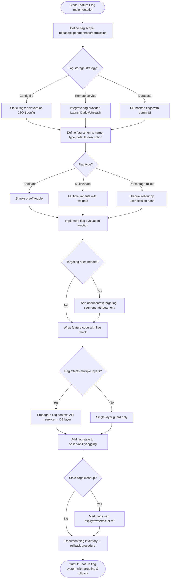

# Skill: Feature Flag Implementation

## Purpose
Implement a complete feature flag system supporting toggles, percentage rollouts, and targeting.

## Input
| Variable | Type | Req | Description |
|----------|------|-----|-------------|
| `tech_stack` | string | Yes | e.g., "Node.js + Redis" |
| `feature_description` | string | Yes | Behavior, audience, and rollout plan |
| `flag_requirements` | string | Yes | Storage backend and evaluation context |

## Instructions
- **Schema**: Define Name (kebab-case), Type (boolean/percentage/user list), Default fallback, and Metadata (owner/expiry).
- **Storage**: Implement CRUD operations and a zero-downtime update strategy for configurations (JSON/YAML).
- **Engine**: Build evaluation logic using user ID hashing for deterministic rollouts. Include caching and failure fallbacks.
- **Integration**: Create a clean abstraction layer (no raw env checks). pass evaluated flags from server to client.
- **Cleanup**: Define the lifecycle (Dev -> Test -> Rollout -> Full -> Cleanup). Identify stale flags (>30 days at 100%).

## Edge Cases
| Case | Strategy |
|------|----------|
| Hot paths | Apply aggressive short-TTL in-memory caching. |
| Flag dependencies | Avoid nesting; combine into single multi-state flags. |
| Client-side logic | Evaluate on server; pass results to frontend at page load. |

## Implementation Logic

## Examples
- [Input Example](@examples/input.md)
- [Output Example](@examples/output.md)

## Quality Gate
1. Is the evaluation deterministic?
2. Are fallbacks safe?
3. Is it abstracted from business logic?
4. Is there a cleanup plan?
5. is the system observable?

## MCP Dependencies
- `@upstash/context7-mcp`: Library documentation and examples.

## Changelog
| Version | Date | Description |
|---------|------|-------------|
| 1.1.0 | 2026-03-20 | Restructured: moved examples/references, added compatibility/license |
| 1.0.0 | 2026-03-20 | Initial release |
