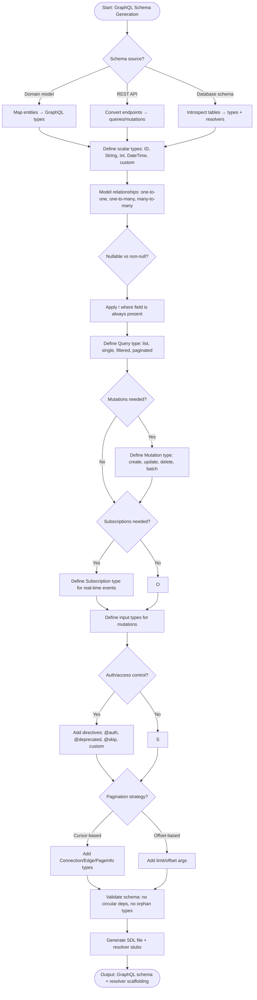

# Skill: GraphQL Schema Generation

## Purpose
Generate complete, best-practice GraphQL schemas including SDL and resolver outlines.

## Input
| Variable | Type | Req | Description |
|----------|------|-----|-------------|
| `tech_stack` | string | Yes | e.g., "Node.js + Apollo Server" |
| `domain_description` | string | Yes | Entities, relations, and business rules |
| `operations` | string | Yes | Required queries, mutations, subscriptions |

## Instructions
- **Types**: Define Object types (nullability), Input types (for mutations), Enums, and Unions. Use Connection types for pagination (Relay spec).
- **Queries**: Implement single lookup, paginated lists, and nested relations using descriptive names.
- **Mutations**: Return mutated payload objects with result/error unions. Add validation rules as comments.
- **Subscriptions**: Define triggers and filter arguments for real-time updates.
- **Resolvers**: Outline structure, identify N+1 risks (DataLoader), and define auth check placement.

## Edge Cases
| Case | Strategy |
|------|----------|
| Circular refs | Use lazy types; enforce resolver depth limits. |
| Large results | Enforce `first` arguments with maximum caps. |
| Field-level Auth | Apply `@auth` directives; specify field-level resolver placement. |

## Schema Flow

## Examples
- [Input Example](@examples/input.md)
- [Output Example](@examples/output.md)

## Quality Gate
1. Are inputs separate from objects?
2. Is pagination enforced on lists?
3. Are error unions included in mutations?
4. is nullability explicitly handled?
5. is the schema Relay-compliant?

## MCP Dependencies
- `@upstash/context7-mcp`: Library documentation and examples.

## Changelog
| Version | Date | Description |
|---------|------|-------------|
| 1.1.0 | 2026-03-20 | Restructured: moved examples/references, added compatibility/license |
| 1.0.0 | 2026-03-20 | Initial release |
