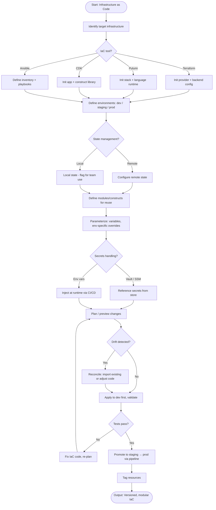

# Skill: Infrastructure as Code

## Purpose
Generate modular, secure, and production-ready IaC templates (Terraform, Pulumi, CDK).

## Input
| Variable | Type | Req | Description |
|----------|------|-----|-------------|
| `tech_stack` | string | Yes | Cloud provider + App stack |
| `iac_tool` | string | Yes | e.g., "Terraform", "AWS CDK (Python)" |
| `infrastructure_requirements` | string | Yes | Required resources, network, DB, security |

## Instructions
- **Structure**: Show modular file organization for reusability. Separate Dev/Staging/Prod environments.
- **Templates**: Generate resources with typed variables, descriptions, and defaults. Include output values.
- **Tagging**: Apply environment, project, and management tags to all resources.
- **Security**: Implement least-privilege IAM policies. Ensure encryption at rest/transit and network isolation (VPC/Private subnets). No hardcoded secrets.
- **State**: Configure remote state (S3/DynamoDB, Pulumi Cloud) with locking and environment isolation.
- **Usage**: Provide CLI commands for initialization, planning, and application.

## Edge Cases
| Case | Strategy |
|------|----------|
| Multi-region | Generate region-instantiable modules; note cross-region state complexity. |
| Existing Infra | Provide `terraform import` or `fromLookup` instructions. |
| Cost Control | Suggest cheaper non-prod alternatives (e.g., smaller instances). |

## IaC Flow

## Examples
- [Input Example](@examples/input.md)
- [Output Example](@examples/output.md)

## Quality Gate
1. Is the state managed remotely?
2. Are IAM policies least-privilege?
3. Are resources tagged correctly?
4. Is the module reusable across envs?
5. is there a plan/apply verification path?

## MCP Dependencies
- `@upstash/context7-mcp`: Library documentation and examples.

## Changelog
| Version | Date | Description |
|---------|------|-------------|
| 1.1.0 | 2026-03-20 | Restructured: moved examples/references, added compatibility/license |
| 1.0.0 | 2026-03-20 | Initial release |
