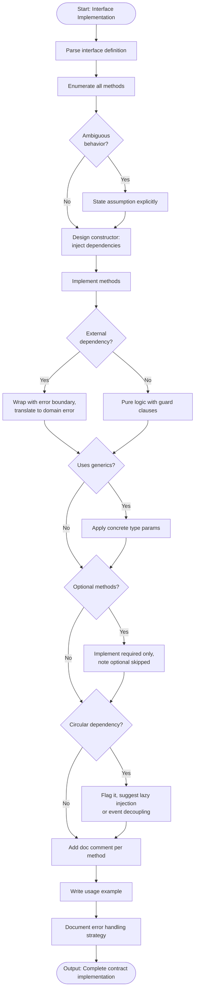

# Skill: Interface Contract Implementation

## Purpose
Implement all methods of a defined contract with full type safety, error handling, and documentation.

## Input
| Variable | Type | Req | Description |
|----------|------|-----|-------------|
| `tech_stack` | string | Yes | e.g., "TypeScript + Node.js" |
| `interface_definition` | string | Yes | Full definition of the contract |
| `context` | string | Yes | Purpose, dependencies, and constraints |

## Instructions
- **Implementation**: Code every method. Use full type system features (Generics, Unions, Enums). No stubs.
- **Documentation**: Provide TSDoc/JSDoc comments for every method (Description, Params, Returns, Errors, Side Effects).
- **Error Handling**: Implement a clear approach (Exceptions/Result types). Distinguish between fatal and recoverable states.
- **Usage**: Show a realistic example of instantiating and using the implementation.
- **Assumptions**: Explicitly list all assumptions if method behavior is ambiguous from the definition.

## Edge Cases
| Case | Strategy |
|------|----------|
| Optional methods | Implement required logic; note skipped overrides. |
| Generics | Apply concrete parameters for the context; note generalization paths. |
| Circular deps | Flag in context; suggest lazy injection or event decoupling. |

## Implementation Flow

## Examples
- [Input Example](@examples/input.md)
- [Output Example](@examples/output.md)

## Quality Gate
1. Are all methods implemented?
2. Is it 100% type-safe?
3. Are error boundaries implemented?
4. Are doc comments complete?
5. is there a usage example?

## MCP Dependencies
- `@upstash/context7-mcp`: Library documentation and examples.

## Changelog
| Version | Date | Description |
|---------|------|-------------|
| 1.1.0 | 2026-03-20 | Restructured: moved examples/references, added compatibility/license |
| 1.0.0 | 2026-03-20 | Initial release |
