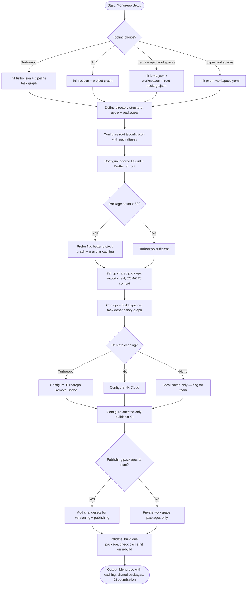

# Skill: Monorepo Setup

## Purpose
Configure a scalable monorepo with efficient code sharing, cached build pipelines, and CI optimizations using Turborepo, Nx, or Lerna.

## Input
| Variable | Type | Req | Description |
|----------|------|-----|-------------|
| `tech_stack` | string | Yes | e.g., "TypeScript + Node.js" |
| `packages` | string | Yes | List of apps and shared libraries |
| `tooling` | string | Yes | e.g., "Turborepo", "Nx", "pnpm workspaces" |

## Instructions
- **Structure**: Organize into `apps/` (deployables) and `packages/` (shared libs). Define clear purposes and dependency paths.
- **Root Config**: Generate workspace settings (`package.json`, `pnpm-workspace.yaml`), tool configs (`turbo.json`, `nx.json`), and shared lint/style rules.
- **Shared Packages**: Configure ESM/CJS compatibility via `exports`, root-extending `tsconfig.json`, and standardized build outputs (`dist/`).
- **Pipeline**: Map the task dependency graph. Configure caching (keys/outputs), parallel execution, and watch modes.
- **CI**: Implement affected-only builds. Set up remote caching (Turborepo Remote Cache / Nx Cloud) and estimate time savings.

## Edge Cases
| Case | Strategy |
|------|----------|
| Mixed Languages | Configure tool per-language; note cross-language limitations. |
| NPM Publishing | Add `changesets` for versioning; distinguish private vs. public packages. |
| Large Scale (50+) | Recommend Nx; configure granular caching and affected-only CI immediately. |

## Workflow

## Examples
- [Input Example](@examples/input.md)
- [Output Example](@examples/output.md)

## Quality Gate
1. Build only what changed?
2. Is code shared efficiently?
3. Are root configs consolidated?
4. Is CI optimized (affected)?
5. is the dependency graph valid?

## MCP Dependencies
- `@upstash/context7-mcp`: Library documentation and examples.

## Changelog
| Version | Date | Description |
|---------|------|-------------|
| 1.1.0 | 2026-03-20 | Restructured: moved examples to examples/, references to references/, added compatibility and license fields |
| 1.0.0 | 2026-03-20 | Initial release |
