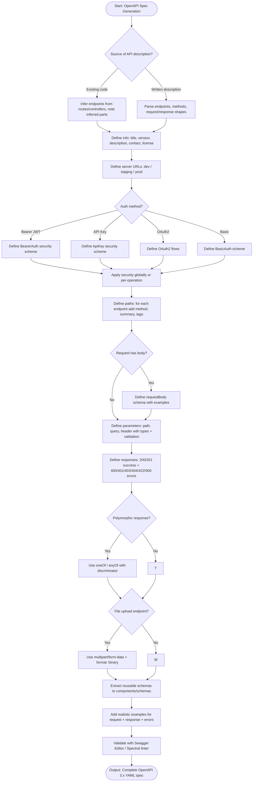

# Skill: OpenAPI Spec Generation

## Purpose
Generate complete OpenAPI 3.x YAML specifications from code or descriptions for SDK generation, documentation, and contract enforcement.

## Input
| Variable | Type | Req | Description |
|----------|------|-----|-------------|
| `tech_stack` | string | Yes | e.g., "Node.js + Express" |
| `api_description` | string | Yes | Endpoints, request/response shapes, auth, errors |
| `context` | string | Yes | Version, base URL, audience, schema reuse |

## Instructions
- **Basics**: Define API info (title/version), server URLs (Dev/Staging/Prod), and contact details.
- **Security**: Implement schemes (JWT, API Key, OAuth2). Apply globally or per-operation.
- **Operations**: Document every endpoint with HTTP method, parameters (typed/validated), request body, and exhaustive response codes (200-500).
- **Components**: Extract reusable schemas for bodies, responses, parameters, and consistent error formats.
- **Examples**: Provide realistic data for request/success/error scenarios.
- **Validation**: Recommend linting with Spectral or Swagger Editor.

## Edge Cases
| Case | Strategy |
|------|----------|
| No existing docs | Infer behavior from code; flag inferred endpoints for review. |
| Polymorphism | Use `oneOf`/`anyOf` with discriminator fields. |
| File uploads | Use `multipart/form-data` with `format: binary`. |

## Generation Workflow

## Examples
- [Input Example](@examples/input.md)
- [Output Example](@examples/output.md)

## Quality Gate
1. Is it valid YAML 3.x?
2. Are all 4xx/5xx responses defined?
3. Are security schemes applied?
4. Are schemas reused via components?
5. Is the spec linted/validated?

## MCP Dependencies
- `@upstash/context7-mcp`: Library documentation and examples.

## Changelog
| Version | Date | Description |
|---------|------|-------------|
| 1.1.0 | 2026-03-20 | Restructured: moved examples to examples/, references to references/, added compatibility and license fields |
| 1.0.0 | 2026-03-20 | Initial release |
