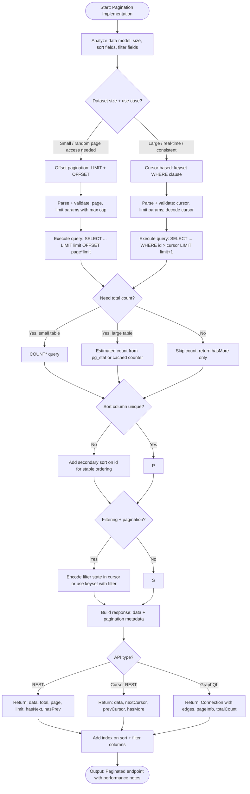

# Skill: Pagination Implementation

## Purpose
Implement efficient backend pagination (Cursor or Offset) with navigation metadata and performance optimization.

## Input
| Variable | Type | Req | Description |
|----------|------|-----|-------------|
| `tech_stack` | string | Yes | e.g., "Node.js + Prisma" |
| `api_or_ui` | string | Yes | Target: REST, GraphQL, or UI list |
| `data_model` | string | Yes | Table name, sort/filter fields, row count |

## Instructions
- **Strategy Selection**: Choose Offset (random access, simple) vs. Cursor (consistent, scales better) based on dataset size and mutation frequency.
- **Backend Implementation**: Validate parameters. Execute query with `LIMIT/OFFSET` or `WHERE` keyset. count records efficiently (avoid full counts on large tables).
- **Response Schema**: 
  - REST: `{ data, total, page, limit, hasNext, hasPrev }`
  - Cursor: `{ data, nextCursor, prevCursor, hasMore }`
  - GraphQL: Connection/Edges/PageInfo.
- **Performance**: Require indexes on sort/filter columns. Use estimated or cached counts for large datasets.
- **Client Usage**: Provide an example of iterative fetching.

## Edge Cases
| Case | Strategy |
|------|----------|
| Non-unique Sort | Add secondary `id` sort to ensure stable ordering. |
| Filter + Pagination | Encode filter state in cursor or use keyset-compatible filters. |
| High Row Count | Use `pg_stat` estimates or cached counters instead of `COUNT(*)`. |

## Pagination Logic

## Examples
- [Input Example](@examples/input.md)
- [Output Example](@examples/output.md)

## Quality Gate
1. Is the strategy justified by scale?
2. Are sort columns indexed?
3. Is ordering stable?
4. Are large counts handled efficiently?
5. is the response schema standard?

## MCP Dependencies
- `@upstash/context7-mcp`: Library documentation and examples.

## Changelog
| Version | Date | Description |
|---------|------|-------------|
| 1.1.0 | 2026-03-20 | Restructured: moved examples to examples/, references to references/, added compatibility and license fields |
| 1.0.0 | 2026-03-20 | Initial release |
