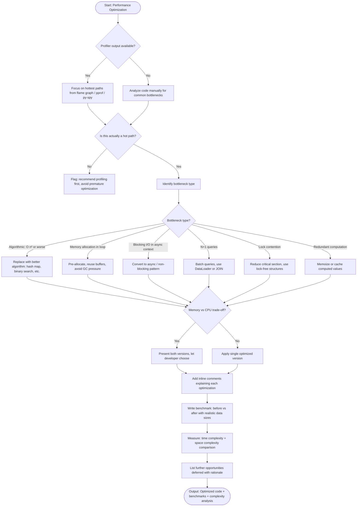

# Skill: Performance Optimization

## Purpose
Identify bottlenecks, implement targeted algorithmic/memory fixes, and verify improvements via benchmarks.

## Input
| Variable | Type | Req | Description |
|----------|------|-----|-------------|
| `tech_stack` | string | Yes | e.g., "Node.js + TypeScript" |
| `code` | string | Yes | Target logic (hot path) |
| `performance_issue` | string | Yes | Symptoms, measurements, or profiler logs |

## Instructions
- **Analysis**: Identify root causes (Algorithmic complexity, memory allocation, I/O blocking, lock contention). Provide current Big-O.
- **Implementation**: Rewrite with fixes. Preserve behavior. Use stack-idiomatic high-performance patterns.
- **Complexity**: Contrast Optimized vs. Original Time/Space complexity in a table.
- **Benchmarking**: Provide code using standard tools (Benchmark.js, Go testing.B, etc.). Test with realistic data sizes.
- **Future Ops**: List deferred optimizations with rationale and triggers for implementation.

## Edge Cases
| Case | Strategy |
|------|----------|
| Profiler available | Base analysis on hottest flame graph paths; avoid guesswork. |
| Premature Opt Risk | Flag risk; recommend profiling before implementing complex fixes. |
| Memory vs CPU | Present both optimized versions; provide a decision matrix. |

## Optimization Flow

## Examples
- [Input Example](@examples/input.md)
- [Output Example](@examples/output.md)

## Quality Gate
1. Is behavior preserved 100%?
2. Is the bottleneck empirically identified?
3. Is the benchmark realistic?
4. Is Time/Space complexity improved?
5. is the code still maintainable?

## MCP Dependencies
- `@upstash/context7-mcp`: Library documentation and examples.
- `@modelcontextprotocol/server-sequential-thinking`: Complex reasoning.

## Changelog
| Version | Date | Description |
|---------|------|-------------|
| 1.1.0 | 2026-03-20 | Restructured: moved examples to examples/, references to references/, added compatibility and license fields |
| 1.0.0 | 2026-03-20 | Initial release |
