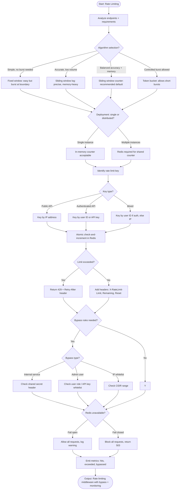

# Skill: Rate Limiting

## Purpose
Implement configurable rate limiting middleware with standard headers, multiple algorithms, and bypass rules.

## Input
| Variable | Type | Req | Description |
|----------|------|-----|-------------|
| `tech_stack` | string | Yes | e.g., "Node.js + Express + Redis" |
| `endpoint_description` | string | Yes | Targets (Public, Auth, Uploads, etc.) |
| `rate_limit_requirements` | string | Yes | Limits per window, keys (IP/UID), bypasses |

## Instructions
- **Algorithm**: Select between Fixed Window, Sliding Window (Log/Counter), or Token Bucket based on burst requirements.
- **Middleware**: Implement atomic check-and-increment in Redis. Return 429 with `Retry-After` on exhaustion.
- **Headers**: Add `X-RateLimit-Limit`, `X-RateLimit-Remaining`, and `X-RateLimit-Reset` to all responses.
- **Configuration**: Allow per-endpoint/group overrides and environment-specific strictness.
- **Bypass**: Implement rules for internal services (shared secret), admins, or IP whitelists.
- **Observability**: Add metrics for hits, exceeded, and bypassed requests.

## Edge Cases
| Case | Strategy |
|------|----------|
| Distributed Env | Use Redis for shared state across instances. |
| Redis Down | Implement fallback (Fail Open/Closed) based on config flag. |
| Proxy/LB | Trust `X-Forwarded-For` only from known proxy IPs. |

## Rate Limit Flow

## Examples
- [Input Example](@examples/input.md)
- [Output Example](@examples/output.md)

## Quality Gate
1. Are operations atomic (Redis)?
2. Are standard headers included?
3. Is bypass logic secure?
4. Are failure modes handled?
5. is it performance-tuned?

## MCP Dependencies
- `@upstash/context7-mcp`: Library documentation and examples.

## Changelog
| Version | Date | Description |
|---------|------|-------------|
| 1.1.0 | 2026-03-20 | Restructured: moved examples to examples/, references to references/, added compatibility and license fields |
| 1.0.0 | 2026-03-20 | Initial release |
