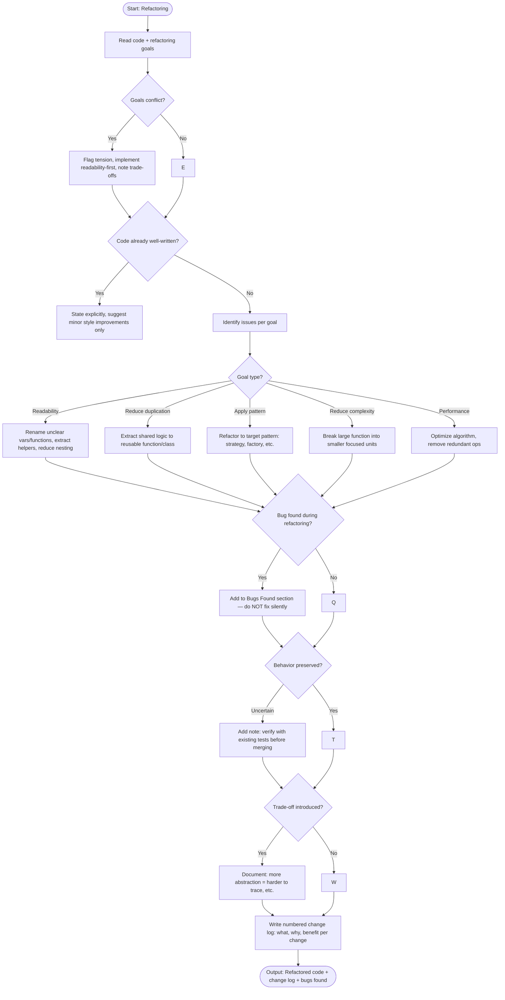

# Skill: Refactoring

## Purpose
Improve code quality (readability, maintainability, performance) without altering observable behavior, using stack-idiomatic patterns.

## Input
| Variable | Type | Req | Description |
|----------|------|-----|-------------|
| `tech_stack` | string | Yes | e.g., "TypeScript + React" |
| `code` | string | Yes | Logic to be refactored |
| `refactoring_goals` | string | Yes | e.g., "Reduce complexity", "Apply Factory pattern" |

## Instructions
- **Behavior Preservation**: Ensure identical outputs for all inputs. Flag bugs separately; do NOT fix them silently.
- **Idiomatic Patterns**: Use ecosystem-standard conventions and libraries.
- **Change Log**: Provide a numbered list of changes covering **What**, **Why**, and **Benefit**.
- **Trade-offs**: Explicitly state any introduced trade-offs (e.g., abstraction vs. traceability).
- **Bug Reporting**: List discovered bugs in a "Bugs Found (Not Fixed)" section.
- **Scope**: Maintain original signatures and features unless goals explicitly dictate changes.

## Edge Cases
| Case | Strategy |
|------|----------|
| Large code blocks | Process in logical chunks (functions/modules); warn about scale risks. |
| Conflicting goals | Prioritize readability; note performance/complexity trade-offs. |
| Clean code | State that no significant improvements are possible; suggest minor style tweaks. |

## Refactoring Flow

## Examples
- [Input Example](@examples/input.md)
- [Output Example](@examples/output.md)

## Quality Gate
1. Is behavior preserved?
2. Are changes idiomatic?
3. Is every change justified?
4. Are trade-offs documented?
5. are bugs flagged but not fixed?

## MCP Dependencies
- `@upstash/context7-mcp`: Library documentation and examples.
- `@modelcontextprotocol/server-sequential-thinking`: Complex reasoning.
- `@modelcontextprotocol/server-memory`: Knowledge graph.

## Changelog
| Version | Date | Description |
|---------|------|-------------|
| 1.1.0 | 2026-03-20 | Restructured: moved examples to examples/, references to references/, added compatibility and license fields |
| 1.0.0 | 2026-03-20 | Initial release |
