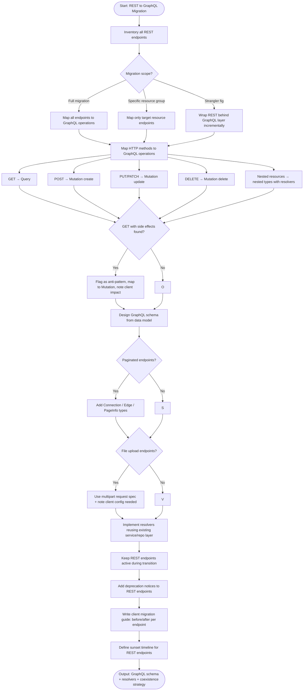

# Skill: REST to GraphQL Migration

## Purpose
Plan and implement an incremental migration from REST to GraphQL, including schema design, resolver logic sharing, and client transition guides.

## Input
| Variable | Type | Req | Description |
|----------|------|-----|-------------|
| `tech_stack` | string | Yes | e.g., "Express -> Apollo" |
| `rest_api_spec` | string | Yes | Endpoints, schemas, and auth methods |
| `migration_scope` | string | Yes | Full, resource-group, or Strangler Fig |

## Instructions
- **Mapping**: Map REST methods to GraphQL operations (GET -> Query; POST/PUT/DELETE -> Mutations). Convert nested resources to nested types with resolvers.
- **Schema**: Design types mirrored from REST response shapes. Consolidate endpoints and add Connections for pagination.
- **Resolvers**: Implement resolvers that call existing service/repository layers to prevent logic duplication.
- **Coexistence**: Keep REST active with deprecation notices. Recommend a sunset timeline.
- **Migration Guide**: Provide before/after examples. Document auth handling (Headers) and error mapping (Status Codes -> GraphQL Errors).

## Edge Cases
| Case | Strategy |
|------|----------|
| Side-effect GETs | Flag as anti-patterns; map to Mutations in GraphQL. |
| File Uploads | Use Multipart Request spec; note client config requirements. |
| Batch Endpoints | Map to list mutations or use DataLoader for resolver-level batching. |

## Migration Flow

## Examples
- [Input Example](@examples/input.md)
- [Output Example](@examples/output.md)

## Quality Gate
1. Is logic shared with existing REST?
2. Is the schema Relay/Connection compliant?
3. Is auth consistency maintained?
4. Is there a clear client upgrade path?
5. is the coexistence strategy zero-downtime?

## MCP Dependencies
- `@upstash/context7-mcp`: Library documentation and examples.

## Changelog
| Version | Date | Description |
|---------|------|-------------|
| 1.1.0 | 2026-03-20 | Restructured: moved examples to examples/, references to references/, added compatibility and license fields |
| 1.0.0 | 2026-03-20 | Initial release |
