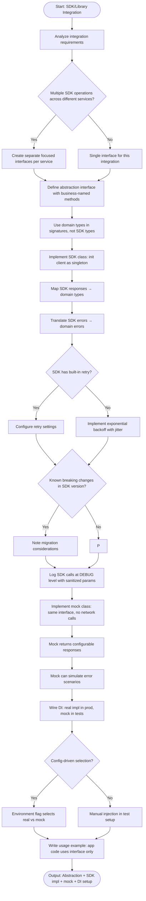

# Skill: SDK/Library Integration

## Purpose
Integrate third-party SDKs using an abstraction layer, domain-specific types, retry logic, and test mocks to decouple external dependencies from application logic.

## Input
| Variable | Type | Req | Description |
|----------|------|-----|-------------|
| `tech_stack` | string | Yes | e.g., "TypeScript + Node.js" |
| `sdk_name` | string | Yes | Name and version (e.g., "Stripe v14") |
| `integration_requirements` | string | Yes | Supported ops, error cases, config |

## Instructions
- **Abstraction**: Define an interface with business-named methods (e.g., `chargeCustomer`, not `sdk.charges.create`). Use domain types in signatures.
- **Implementation**: Create a singleton wrapper for the SDK. Map responses/errors to domain types. Add retry logic (Backoff + Jitter) for transient failures.
- **Mocks**: Provide a stub implementation for unit tests that simulates responses and errors without network calls.
- **Dependency Injection**: Show how to wire the real vs. mock implementation based on configuration/environment flags.
- **Usage**: Provide an example of application code calling the abstraction.

## Edge Cases
| Case | Strategy |
|------|----------|
| No built-in retry | Implement exponential backoff wrapper/decorator. |
| Breaking changes | Document migration path and version-specific constraints. |
| Multiple clients | Split into focused interfaces per service/responsibility. |

## Workflow

## Examples
- [Input Example](@examples/input.md)
- [Output Example](@examples/output.md)

## Quality Gate
1. Is the SDK completely hidden?
2. Are domain types used?
3. Is retry logic implemented?
4. Is there a test mock?
5. is the logger sanitized?

## MCP Dependencies
- `@upstash/context7-mcp`: Library documentation and examples.

## Changelog
| Version | Date | Description |
|---------|------|-------------|
| 1.1.0 | 2026-03-20 | Restructured: moved examples to examples/, references to references/, added compatibility and license fields |
| 1.0.0 | 2026-03-20 | Initial release |
