# Skill: Senior Code Review

## Purpose
Perform a production-readiness evaluation focusing on reliability, security, scale, and observability.

## Input
| Variable | Type | Req | Description |
|----------|------|-----|-------------|
| `tech_stack` | string | Yes | e.g., "Node.js + Express" |
| `code` | string | Yes | Paste full function/class/module |
| `context` | string | Yes | Traffic, SLA, PII, conventions |

## Instructions
- **Evaluation**: Analyze across 6 dimensions: Error Handling, Security, Performance, Observability, Test Coverage, and Documentation.
- **Findings**: For each issue, provide **Severity** (P0-P3), **Dimension**, **Location**, **Problem**, and **Fix** (with code example).
- **Severity Guidelines**:
  - P0: Blocks production (data loss, breach, outage).
  - P1: Must fix before merge (incorrect behavior).
  - P2: Should fix soon (technical debt, minor risks).
  - P3: Nice to have (style, minor improvements).
- **Summary**: Provide a final verdict (READY / MINOR FIXES / NOT READY) and a list of the **Top 5 Must-Fix Items**.

## Review Dimensions
| Dimension | Focus Areas |
|-----------|-------------|
| Error Handling | Propagation, retry logic, fail-safe modes. |
| Security | Input validation, secrets, PII, authz/authn. |
| Performance | Big-O, N+1, leaks, locking, caching. |
| Observability | Log levels, context, metrics, tracing. |
| Test Coverage | Happy/Error/Edge cases, testability. |
| Documentation | "Why" logic, API docs, limitations. |

## Edge Cases
| Case | Strategy |
|------|----------|
| Large Code (>300 lines) | Focus on high-risk sections (Auth, mutation, payments). |
| No Tests | Rate as P1 Coverage finding; provide a test plan. |
| Legacy Context | Distinguish pre-existing debt from new risks. |

## Review Flow

```mermaid
flowchart TD
    A([Start: Senior Code Review]) --> B{Code size?}
    B -- Over 300 lines --> C[Focus on highest-risk sections: auth, payment, data mutation]
    B -- Under 300 lines --> D[Full review across all 6 dimensions]
    C & D --> E[Dimension 1: Error Handling]
    E --> E1{All failure paths handled?}
    E1 -- No --> E2[P0/P1: unhandled path → production incident risk]
    E1 -- Yes --> F
    E2 & F --> G[Dimension 2: Security]
    G --> G1{Input validation present?}
    G1 -- No --> G2[P0: injection / traversal vulnerability]
    G1 -- Yes --> G3{Sensitive data in logs?}
    G3 -- Yes --> G4[P0: PII / secret leak]
    G3 -- No --> H
    G2 & G4 & H --> I[Dimension 3: Performance]
    I --> I1{O n² or worse on unbounded input?}
    I1 -- Yes --> I2[P1: algorithmic bottleneck]
    I1 -- No --> I3{N+1 queries?}
    I3 -- Yes --> I4[P1: DB performance issue]
    I3 -- No --> J
    I2 & I4 & J --> K[Dimension 4: Observability]
    K --> K1{Errors logged with context?}
    K1 -- No --> K2[P2: blind spots in production]
    K1 -- Yes --> L
    K2 & L --> M[Dimension 5: Test Coverage]
    M --> M1{Error paths tested?}
    M1 -- No --> M2[P1: untested failure modes]
    M1 -- Yes --> N
    M2 & N --> O[Dimension 6: Documentation]
    O --> P{Legacy code context?}
    P -- Yes --> Q[Distinguish new risks vs pre-existing tech debt]
    P -- No --> R
    Q & R --> S[Rate all findings: P0 / P1 / P2 / P3]
    S --> T[Produce: Production Readiness Verdict + Top 5 Must-Fix]
    T --> U([Output: Severity-rated review across 6 dimensions])
```

## Examples
- [Input Example](@examples/input.md)
- [Output Example](@examples/output.md)

## Quality Gate
1. Are findings actionable?
2. Is severity justified by risk?
3. Are security P0s prioritized?
4. Is observability addressed?
5. is the verdict objective?

## MCP Dependencies
- `@upstash/context7-mcp`: Library documentation and examples.
- `@modelcontextprotocol/server-sequential-thinking`: Complex reasoning.
- `@modelcontextprotocol/server-memory`: Knowledge graph.

## Changelog
| Version | Date | Description |
|---------|------|-------------|
| 1.1.0 | 2026-03-20 | Restructured: examples/ and references/, added compatibility/license |
| 1.0.0 | 2026-03-20 | Initial release |
