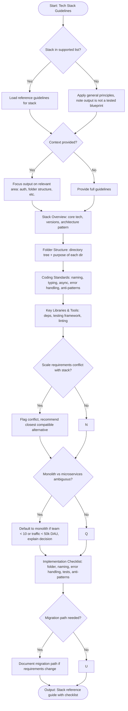

# Skill: Tech Stack Guidelines

## Purpose
Provide architectural blueprints, folder structures, and standards for any of the 14 supported tech stacks to ensure project alignment.

## Input
| Variable | Type | Req | Description |
|----------|------|-----|-------------|
| `tech_stack` | string | Yes | Target stack (see list) |
| `context` | string | No | Focus: e.g., "auth", "folder structure" |

## Supported Stacks
- `laravel` (Modular Monolith)
- `laravel-filament` (ERP/Admin)
- `vuejs`, `react`, `nextjs`, `nuxtjs`
- `flutter` (GetX)
- `express`, `fastapi`, `golang` (Clean Arch)
- `rust` (Axum/Actix)
- `spring-boot`, `dotnet` (Clean Arch)
- `odoo` (ERP Platform)

## Instructions
- **Overview**: Define core tech versions, architectural patterns, and design rationale.
- **Structure**: Provide a recommended directory tree with purpose documentation.
- **Standards**: Detail language rules (typing, async), naming (files, variables), and pattern usage.
- **Tooling**: List essential dependencies, test frameworks, and lint/fmt tools.
- **Checklist**: Provide a validation list (Folder, Naming, Error Handling, Tests, Anti-patterns).
- **Scope**: Focus output on `{{context}}` if specified.

## Edge Cases
| Case | Strategy |
|------|----------|
| Conflicts | Recommend closest compatible alternative; flag the tension. |
| Unfamiliar Stack | Apply general principles; explicitly note it is an untested blueprint. |
| Monolith vs Micro | Default to Monolith for teams <10 or <50k DAU. |

## Guideline Logic

## Examples
- [Input Example](@examples/input.md)
- [Output Example](@examples/output.md)

## Quality Gate
1. Matches the chosen stack?
2. Is the folder tree clear?
3. are anti-patterns listed?
4. is the checklist actionable?
5. Is scale considered?

## MCP Dependencies
- `@upstash/context7-mcp`: Library documentation and examples.
- `@modelcontextprotocol/server-sequential-thinking`: Complex reasoning.
- `@modelcontextprotocol/server-memory`: Knowledge graph.

## Changelog
| Version | Date | Description |
|---------|------|-------------|
| 1.0.0 | 2026-03-20 | Initial release — 14 stacks included |
