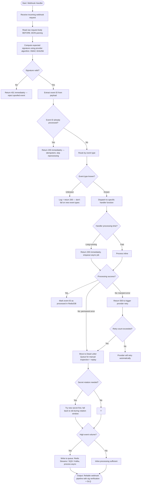

# Skill: Webhook Handler

## Purpose
Implement a secure, reliable webhook receiver with signature verification, idempotency, and retry handling.

## Input
| Variable | Type | Req | Description |
|----------|------|-----|-------------|
| `tech_stack` | string | Yes | e.g., "Node.js + Express" |
| `webhook_provider` | string | Yes | e.g., "Stripe", "GitHub" |
| `event_types` | string | Yes | Events to process |

## Instructions
- **Verification**: Retrieve raw body BEFORE parsing. Compute and compare signatures using constant-time logic. Reject invalid requests (401).
- **Idempotency**: Extract Event ID. Return 200 immediately if already processed. Mark success in Redis/DB.
- **Routing**: Dispatch to dedicated handlers per event type. Log unknown events; return 200.
- **Reliability**: Return 500 for transient failures. Move to DLQ after N attempts for manual replay.
- **Async**: For long-running tasks, return 200 immediately and enqueue for background processing.

## Edge Cases
| Case | Strategy |
|------|----------|
| Out of Order | Implement state machine or timestamp-based ordering. |
| Secret Rotation | Implement dual-secret verification (Old/New) during window. |
| High Volume | Queue events immediately; process asynchronously. |

## Workflow Logic

## Examples
- [Input Example](@examples/input.md)
- [Output Example](@examples/output.md)

## Quality Gate
1. Is signature verification constant-time?
2. is idempotency enforced?
3. Are transient errors 500ed?
4. is DLQ implemented?
5. is heavy work async?

## MCP Dependencies
- `@upstash/context7-mcp`: Library documentation and examples.

## Changelog
| Version | Date | Description |
|---------|------|-------------|
| 1.1.0 | 2026-03-20 | Restructured: moved examples/references, added compatibility/license |
| 1.0.0 | 2026-03-20 | Initial release |
