# Skills: Debugging (26 skills)

This category contains skills for debugging, error analysis, and problem diagnosis.

## Subdirectory Structure

Each skill in the `debugging` category has the following structure:

```
{skill-name}/
├── SKILL.md          # Core instructions (≤500 lines)
├── references/       # Supporting technical documentation
│   ├── README.md
│   └── compatibility-matrix.md
└── examples/         # Concrete input/output examples
    ├── input.md
    └── output.md
```

## Skills

| Skill | Description |
|-------|-------------|
| `api-timeout-debugging` | Debug timeouts in API calls |
| `async-await-error-tracing` | Trace errors in async/await code |
| `authentication-token-debugging` | Debug authentication and token issues |
| `build-failure-analysis` | Analyze build failures |
| `container-crash-analysis` | Analyze container/pod crashes |
| `cors-error-resolution` | Resolve CORS errors |
| `data-corruption-investigation` | Investigate data corruption |
| `database-query-slow-analysis` | Analyze slow database queries |
| `deadlock-analysis` | Analyze and resolve deadlocks |
| `deep-audit` | Audit 5-layer architecture violations and N+1 queries |
| `dependency-conflict-resolution` | Resolve dependency conflicts |
| `deployment-failure-diagnosis` | Diagnose deployment failures |
| `environment-variable-misconfiguration` | Debug environment variable misconfigurations |
| `error-analysis` | Analyze error messages and stack traces |
| `fix-suggestion` | Suggest fixes for identified bugs |
| `infinite-loop-detection` | Detect and fix infinite loops |
| `log-interpretation` | Interpret application logs |
| `memory-leak-detection` | Detect memory leaks |
| `network-latency-diagnosis` | Diagnose network latency issues |
| `null-pointer-undefined-analysis` | Analyze null pointer/undefined errors |
| `oom-debugging` | Debug Out of Memory errors |
| `performance-bottleneck-analysis` | Analyze performance bottlenecks |
| `race-condition-detection` | Detect race conditions |
| `root-cause-identification` | Identify root causes of problems |
| `security-vulnerability-triage` | Triage security vulnerabilities |
| `type-mismatch-debugging` | Debug type mismatch errors |

---

## Mermaid Diagram

```mermaid
flowchart TD
    A([Bug / Failure / Issue]) --> B{Symptom Type}

    B -- Stack trace / exception --> C[error-analysis\n→ root-cause-identification]
    B -- Logs only, no stack trace --> D[log-interpretation]
    B -- Build or deploy fails --> E{Which?}
    E -- Build --> F[build-failure-analysis]
    E -- Deploy --> G[deployment-failure-diagnosis]
    B -- Performance degradation --> H[performance-bottleneck-analysis]
    B -- Architecture / code smell --> I[deep-audit]

    B -- Async/await errors --> J[async-await-error-tracing]
    B -- Auth / token failures --> K[authentication-token-debugging]
    B -- API timeouts --> L[api-timeout-debugging]
    B -- CORS errors --> M[cors-error-resolution]
    B -- Container crashing --> N[container-crash-analysis]
    B -- Data incorrect / missing --> O[data-corruption-investigation]
    B -- Slow DB query --> P[database-query-slow-analysis]
    B -- Deadlock / threads waiting --> Q[deadlock-analysis]
    B -- Dependency conflicts --> R[dependency-conflict-resolution]
    B -- Wrong env variables --> S[environment-variable-misconfiguration]
    B -- Infinite loop / 100% CPU --> T[infinite-loop-detection]
    B -- Memory growing / OOM --> U{Which?}
    U -- Leak --> V[memory-leak-detection]
    U -- OOM crash --> W[oom-debugging]
    B -- High network latency --> X[network-latency-diagnosis]
    B -- Null pointer / undefined --> Y[null-pointer-undefined-analysis]
    B -- Race condition --> Z[race-condition-detection]
    B -- Security vulnerability --> AA[security-vulnerability-triage]
    B -- Type mismatch --> AB[type-mismatch-debugging]

    C & D & F & G & H & I --> AC[fix-suggestion\n→ Apply fix]
```


