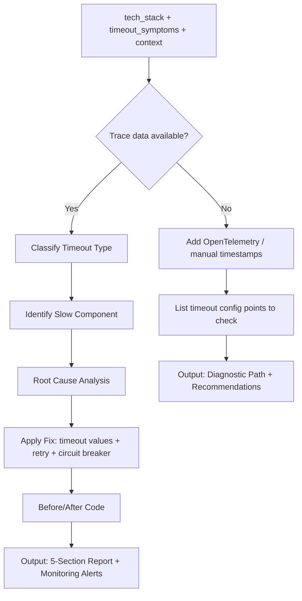

# Skill: API Timeout Debugging

## Purpose
Diagnose API timeouts using trace data to identify slow components and implement remediation strategies (retries, breakers, budget adjustments).

## Input
| Variable | Type | Req | Description |
|----------|------|-----|-------------|
| `tech_stack` | string | Yes | e.g., "Node.js + Axios + Express" |
| `timeout_symptoms` | string | Yes | Endpoint, duration, frequency, user impact |
| `trace_data` | string | No | Distributed trace or span timings |
| `context` | string | Yes | Arch, downstream deps, config, recent changes |

## Instructions
- **Classification**: Determine timeout type (Client, Server, Gateway, Downstream, Connection).
- **Identification**: Pinpoint source (App, DB, API, Internal Service, Queue).
- **Root Cause**: Analyze reasons (Missing indexes, rate limits, resource exhaustion, blocking code).
- **Remediation**:
  - Implement corrected timeout values.
  - Apply exponential backoff with jitter for retries.
  - Add circuit breakers for failing downstream services.
  - Optimize via async/parallel execution.
- **Monitoring**: Define alert rules (P99 latency, error rates) and dashboard metrics.
- **Fallback**: If no trace data, provide OTel setup commands and manual timing strategies.

## Edge Cases
| Case | Strategy |
|------|----------|
| No Trace Data | Activate OTel setup path; provide manual timing templates. |
| Expected Slowness | Recommend transition to async jobs with polling/webhooks. |
| Cascading Timeouts | Identify root service; implement decreasing timeout budgets downstream. |

## Diagnostic Logic

## Examples
- [Input Example](@examples/input.md)
- [Output Example](@examples/output.md)

## Quality Gate
- [ ] Slow component identified.
- [ ] Timeout budgets adjusted.
- [ ] Circuit breaker considered.
- [ ] Retries are idempotent.
- [ ] Tracing enabled/recommended.

## MCP Dependencies
- `@upstash/context7-mcp`: Library documentation and examples.

## Changelog
| Version | Date | Description |
|---------|------|-------------|
| 1.1.0 | 2026-03-20 | Restructured: examples/ and references/, added compatibility/license |
| 1.0.0 | 2026-03-20 | Initial release |
