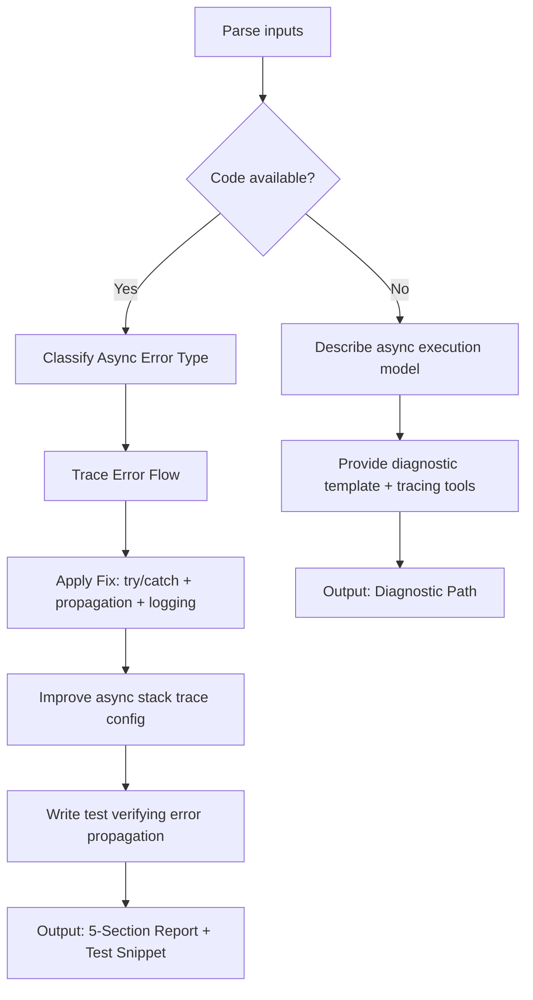

# Skill: Async/Await Error Tracing

## Purpose
Trace and fix async errors including unhandled rejections, missing awaits, and event loop blocking.

## Input
| Variable | Type | Req | Description |
|----------|------|-----|-------------|
| `tech_stack` | string | Yes | e.g., "Node.js + Express" |
| `error_message` | string | Yes | e.g., "UnhandledPromiseRejection" |
| `code` | string | Yes | Async logic section |
| `context` | string | Yes | Op flow and error expectations |

## Instructions
- **Classification**: Identify type (Unhandled rejection, missing await, swallowing, loop blocking, forEach async, race).
- **Trace**: Map execution path from creation to rejection and catch sites.
- **Remediation**:
  - Wrap awaits in `try/catch`.
  - Ensure proper error propagation and re-throwing.
  - Add contextual logging.
- **Config**: Provide settings for better stack traces (e.g., `--async-stack-traces`).
- **Validation**: Write test snippets verifying propagation (e.g., `expect(...).rejects.toThrow()`).
- **Fallback**: If no code, provide execution model descriptions and diagnostic templates.

## Edge Cases
| Case | Strategy |
|------|----------|
| Async in `forEach` | Recommend `Promise.all(array.map(...))` for sequential/parallel handling. |
| Event Loop Block | Recommend worker threads or `setImmediate` for heavy computation. |
| Intermittent Race | Add diagnostic logs around promise settlement points. |

## Tracing Flow

## Examples
- [Input Example](@examples/input.md)
- [Output Example](@examples/output.md)

## Quality Gate
- [ ] Awaits properly handled.
- [ ] Propagation is explicit.
- [ ] Stack traces improved.
- [ ] Fix verified by tests.
- [ ] Event loop protected.

## MCP Dependencies
- `@upstash/context7-mcp`: Library documentation and examples.
- `@modelcontextprotocol/server-sequential-thinking`: Complex reasoning.

## Changelog
| Version | Date | Description |
|---------|------|-------------|
| 1.1.0 | 2026-03-20 | Restructured: examples/references separated, added fields |
| 1.0.0 | 2026-03-20 | Initial release |
