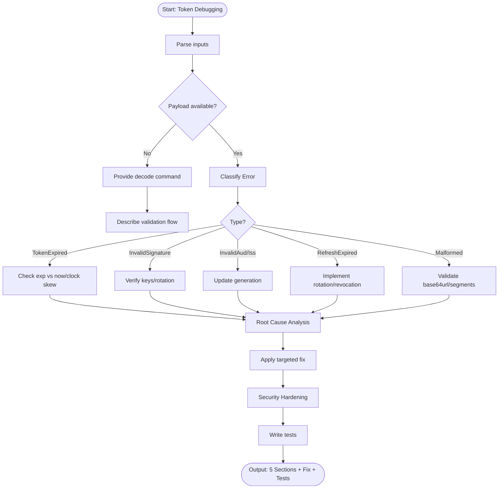

# Skill: Authentication Token Debugging

## Purpose
Diagnose and fix token-related failures including expiry, signature errors, and claim mismatches.

## Input
| Variable | Type | Req | Description |
|----------|------|-----|-------------|
| `tech_stack` | string | Yes | e.g., "Node.js + jsonwebtoken" |
| `token_type` | string | Yes | JWT, OAuth2, API Key, etc. |
| `error_message` | string | Yes | e.g., "TokenExpiredError" |
| `token_payload` | string | No | Decoded payload (omit sensitive data) |

## Instructions
- **Classification**: Identify type (Expired, Invalid Signature, Aud/Iss mismatch, Malformed, Refresh Expired).
- **Analysis**: Explain causes (Clock skew, wrong keys, broken rotation, insecure storage).
- **Remediation**:
  - Expiry: Add refresh logic and clock skew tolerance.
  - Signature: Verify keys and rotation status.
  - Claims: Update generation logic (iss/aud).
  - Refresh: Implement secure rotation/revocation.
- **Hardening**: Recommend short-lived tokens (15m), `httpOnly` cookies, and explicit claim verification.
- **Testing**: Write tests for acceptance, expiry rejection, and tampering detection.
- **Fallback**: If no payload, provide decode commands and claim-verification checklist.

## Edge Cases
| Case | Strategy |
|------|----------|
| No Payload | Provide decode command; describe validation flow failure points. |
| Clock Skew | Recommend `clockTolerance` settings in validation libraries. |
| Key Rotation | Recommend JWKS endpoint integration for dynamic keys. |

## Debugging Workflow

## Examples
- [Input Example](@examples/input.md)
- [Output Example](@examples/output.md)

## Quality Gate
- [ ] Fix is security-compliant.
- [ ] Secrets handled safely.
- [ ] Clock skew addressed.
- [ ] Tests included.
- [ ] Rotation strategy sound.

## MCP Dependencies
- `@upstash/context7-mcp`: Library documentation and examples.

## Changelog
| Version | Date | Description |
|---------|------|-------------|
| 1.1.0 | 2026-03-20 | Restructured: moved examples, references, added compatibility/license |
| 1.0.0 | 2026-03-20 | Initial release |
