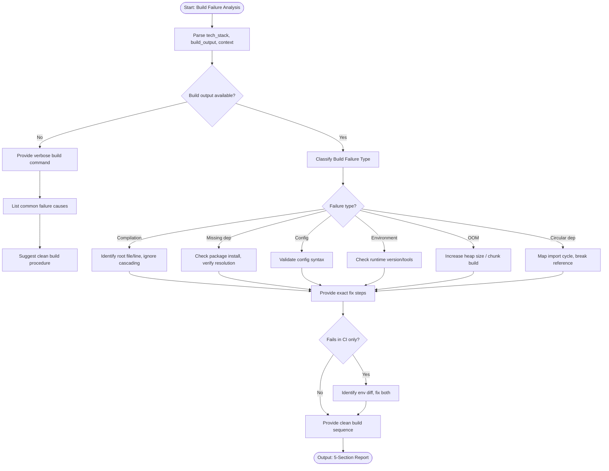

# Skill: Build Failure Analysis

## Purpose
Identify root causes of build/compilation failures and provide exact fix steps and clean build procedures.

## Input
| Variable | Type | Req | Description |
|----------|------|-----|-------------|
| `tech_stack` | string | Yes | Build tool and language |
| `build_output` | string | Yes | Full error logs |
| `context` | string | Yes | Recent changes (code, deps, CI) |

## Instructions
- **Classification**: Identify failure type (Compilation, Missing dependency, Config, Environment, OOM, Circularity).
- **Identification**: Pinpoint exact file, line, and message; ignore cascading artifacts.
- **Remediation**: Provide numbered, actionable steps with exact code/config changes.
- **Cleaning**: Provide shell commands for clean build sequence (e.g., `rm -rf node_modules && install`).
- **CI/CD**: Identify environment differences (version, case sensitivity) for CI-only failures.
- **Fallback**: If no output, provide verbose build commands and common-failure checklist.

## Edge Cases
| Case | Strategy |
|------|----------|
| No Logs | Provide verbose commands; list common causes/diagnostics. |
| CI vs Local | Check version diffs, env vars, and case-sensitive pathing. |
| OOM | Provide memory config (JVM/Node) or incremental build steps. |

## Analysis Logic

## Examples
- [Input Example](@examples/input.md)
- [Output Example](@examples/output.md)

## Quality Gate
- [ ] Root cause identified.
- [ ] Fix steps actionable.
- [ ] Clean build documented.
- [ ] Environment diffs addressed.
- [ ] Tool version checked.

## MCP Dependencies
- `@upstash/context7-mcp`: Library documentation and examples.
- `@modelcontextprotocol/server-sequential-thinking`: Complex reasoning.

## Changelog
| Version | Date | Description |
|---------|------|-------------|
| 1.1.0 | 2026-03-20 | Restructured: examples/references separated, added fields |
| 1.0.0 | 2026-03-20 | Initial release |
