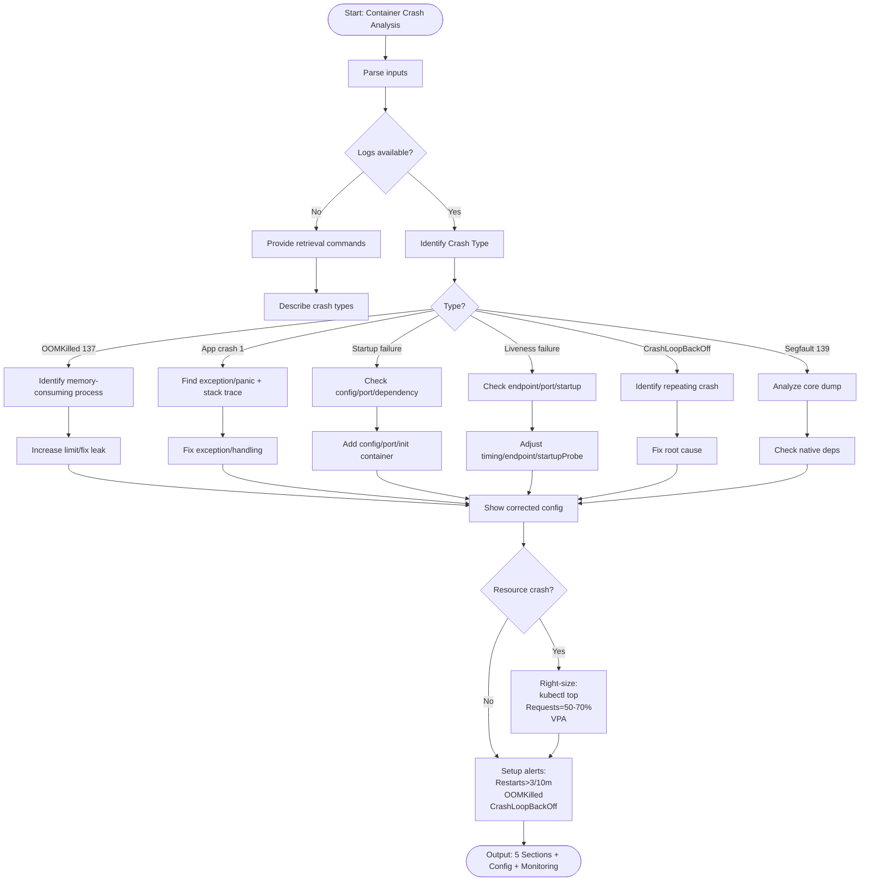

# Skill: Container Crash Analysis

## Purpose
Analyze container/pod failures to identify root causes (OOM, probes, config) and provide targeted fixes.

## Input
| Variable | Type | Req | Description |
|----------|------|-----|-------------|
| `tech_stack` | string | Yes | e.g., "Docker + Kubernetes" |
| `container_logs` | string | Yes | Logs, symptoms, or exit codes |
| `pod_description` | string | No | `kubectl describe pod` output |
| `context` | string | Yes | Limits, changes, crash frequency |

## Instructions
- **Classification**: Identify type (OOMKilled/137, App Crash/1, Startup, Liveness, CrashLoop, Segfault/139).
- **Analysis**: Pinpoint memory-consuming process, exception trace, or missing config.
- **Remediation**: Provide corrected manifests/configs; adjust probe timings.
- **Tuning**: Right-size resources (Requests = 50-70% of limits) using `top pod` or VPA.
- **Monitoring**: Setup alerts for restarts (>3/10m), OOM, and CrashLoop states.
- **Fallback**: If no logs, provide retrieval commands and crash-type checklist.

## Edge Cases
| Case | Strategy |
|------|----------|
| Intermittent | Recommend persistent monitoring for leaks; check graceful shutdown. |
| Init Containers | Use `kubectl logs -c` for init; diagnose as a separate block. |
| High Load OOM | Recommend Vertical Pod Autoscaler (VPA) or horizontal scaling. |

## Diagnostic Workflow

## Examples
- [Input Example](@examples/input.md)
- [Output Example](@examples/output.md)

## Quality Gate
- [ ] Exit code interpreted correctly.
- [ ] Resource limits right-sized.
- [ ] Non-root fix provided.
- [ ] Probes adjusted.
- [ ] Manifest is syntactically correct.

## MCP Dependencies
- `@upstash/context7-mcp`: Library documentation and examples.

## Changelog
| Version | Date | Description |
|---------|------|-------------|
| 1.1.0 | 2026-03-20 | Restructured: moved examples, references, added compatibility/license |
| 1.0.0 | 2026-03-20 | Initial release |
