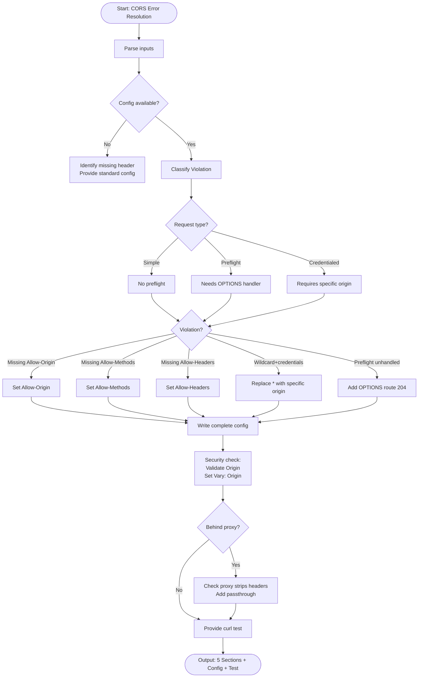

# Skill: CORS Error Resolution

## Purpose
Diagnose browser CORS violations and provide server-side configuration fixes for headers and preflight handling.

## Input
| Variable | Type | Req | Description |
|----------|------|-----|-------------|
| `tech_stack` | string | Yes | e.g., "Node.js + Express" |
| `error_message` | string | Yes | Full browser error message |
| `request_details` | string | Yes | Method, URL, headers, and origin |
| `server_config` | string | No | Current middleware/config |

## Instructions
- **Classification**: Identify violation (Missing `Allow-Origin`, mismatch, preflight unhandled, invalid wildcard).
- **Analysis**: Determine request type (Simple, Preflight/OPTIONS, or Credentialed).
- **Remediation**:
  - Implement correct `Access-Control-Allow-*` headers.
  - Handle OPTIONS with 204 status.
  - Replace `*` with specific origins if credentials required.
- **Security**: Validate origins against whitelist; use `Vary: Origin`.
- **Validation**: Provide `curl -v -X OPTIONS` command to verify headers.
- **Fallback**: If no config, identify likely missing headers and provide stack templates.

## Edge Cases
| Case | Strategy |
|------|----------|
| No Config | Identify header from error; provide standard middleware snippet. |
| Same-Origin mismatch | Check for port, protocol, or subdomain discrepancies. |
| Reverse Proxy | Ensure proxy doesn't strip headers; add passthrough config. |

## Diagnostic Flow

## Examples
- [Input Example](@examples/input.md)
- [Output Example](@examples/output.md)

## Quality Gate
- [ ] Violation correctly identified.
- [ ] Credential rules followed (no `*`).
- [ ] OPTIONS handler included.
- [ ] Security risks flagged.
- [ ] Test command accurate.

## MCP Dependencies
- `@upstash/context7-mcp`: Library documentation and examples.

## Changelog
| Version | Date | Description |
|---------|------|-------------|
| 1.1.0 | 2026-03-20 | Restructured: moved examples, references, added compatibility/license |
| 1.0.0 | 2026-03-20 | Initial release |
