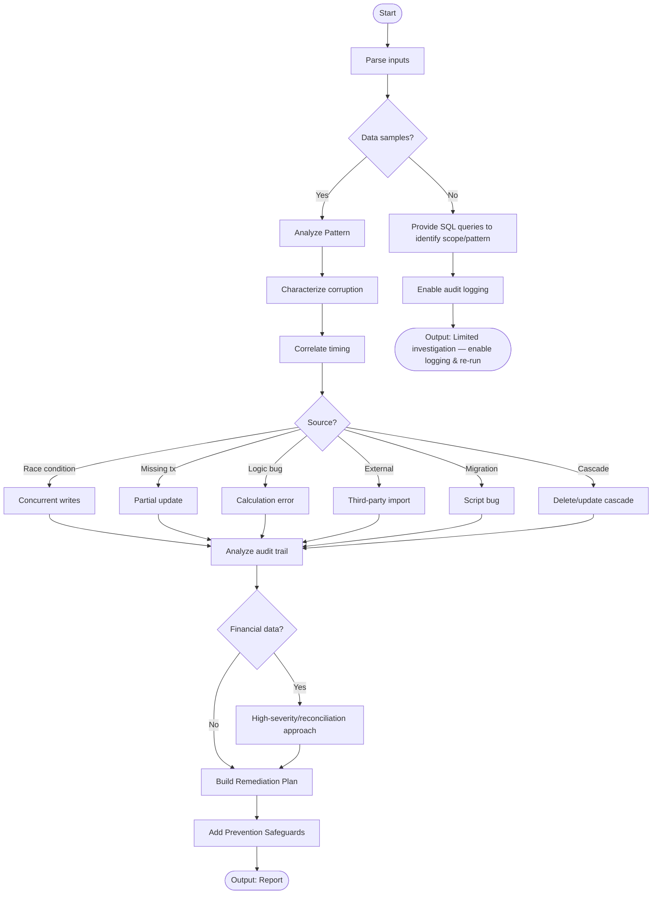

# Skill: Data Corruption Investigation

## Purpose
Analyze data inconsistencies to identify sources (races, logic errors, partial updates) and produce a remediation and prevention plan.

## Input
| Variable | Type | Req | Description |
|----------|------|-----|-------------|
| `tech_stack` | string | Yes | DB + App (e.g., "PostgreSQL + Node.js") |
| `corruption_symptoms` | string | Yes | What is wrong, diffs, timeline |
| `data_samples` | string | Yes | Corrupted vs. expected examples |
| `context` | string | Yes | Arch, concurrent writers, audit logs |

## Instructions
- **Classification**: Characterize by type (missing, duplicate, partial), scope, and timing (deploys/migrations).
- **Source Identification**: Pinpoint root causes (Races, missing transactions, logic bugs, external imports).
- **Remediation**:
  - Perform scope assessment (affected record counts).
  - Create idempotent fix scripts (SQL/App) and backup snapshots.
  - Provide verification queries.
- **Prevention**: Recommend DB constraints (FK, Unique, Check), app-level validation, and CI integrity tests.
- **Fallback**: If no samples, provide SQL scope-detection queries and audit logging instructions.

## Edge Cases
| Case | Strategy |
|------|----------|
| No Samples | Provide diagnostic queries to identify patterns and scope. |
| External Source | Recommend boundary validation and schema-level data quality checks. |
| Financial Data | High-severity; prioritize reconciliation and involve data engineering. |

## Investigation Logic

## Examples
- [Input Example](@examples/input.md)
- [Output Example](@examples/output.md)

## Quality Gate
- [ ] Root cause narrowed down.
- [ ] Fix scripts are safe (idempotent).
- [ ] Backup recommended.
- [ ] Prevention constraints listed.
- [ ] Audit logging addressed.

## MCP Dependencies
- `@upstash/context7-mcp`: Library documentation and examples.
- `@modelcontextprotocol/server-sequential-thinking`: Complex reasoning.

## Changelog
| Version | Date | Description |
|---------|------|-------------|
| 1.1.0 | 2026-03-20 | Restructured: moved examples/references, added fields |
| 1.0.0 | 2026-03-20 | Initial release |
