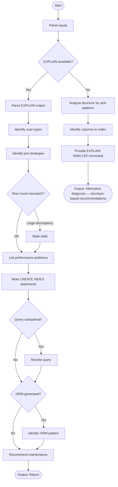

# Skill: Database Query Slow Analysis

## Purpose
Analyze slow SQL queries using EXPLAIN data to identify missing indexes, inefficient joins, or stale statistics, providing exact fixes and maintenance steps.

## Input
| Variable | Type | Req | Description |
|----------|------|----------|-------------|
| `tech_stack` | string | Yes | DB + ORM (e.g., "Postgres + Prisma") |
| `slow_query` | string | Yes | SQL query text |
| `explain_output` | string | No | EXPLAIN / ANALYZE logs |
| `schema` | string | Yes | Table/Index definitions |

## Instructions
- **Plan Analysis**: Identify scan types (Seq vs Index), join strategies, and row count discrepancies (Stale stats).
- **Problem Identification**: Pinpoint sequential scans, missing covering indexes, or inefficient join orders.
- **Indexing**: Write exact `CREATE INDEX` statements; explain accelerated paths and estimated gain.
- **Optimization**: Provide rewritten SQL (Replace correlated subqueries, use UNION ALL, add hints).
- **Maintenance**: Recommend `ANALYZE/VACUUM` and checks for `pg_stat_user_tables`.
- **Fallback**: If no EXPLAIN, analyze structure for anti-patterns and provide `EXPLAIN ANALYZE` commands.

## Edge Cases
| Case | Strategy |
|------|----------|
| No EXPLAIN | Analyze query structure and schema; estimate cost based on size. |
| Indexes Ignored | Check for bloat, lock contention, or stale stats; recommend `BUFFERS`. |
| ORM patterns | Identify N+1 or missing eager loads; provide ORM-level code fixes. |

## Analysis Logic

## Examples
- [Input Example](@examples/input.md)
- [Output Example](@examples/output.md)

## Quality Gate
- [ ] Scan types correctly identified.
- [ ] Row estimate gaps highlighted.
- [ ] SQL rewrite is syntactically correct.
- [ ] Maintenance steps included.
- [ ] ORM context addressed.

## MCP Dependencies
- `@upstash/context7-mcp`: Library documentation and examples.
- `@modelcontextprotocol/server-sequential-thinking`: Complex reasoning.

## Changelog
| Version | Date | Description |
|---------|------|-------------|
| 1.1.0 | 2026-03-20 | Restructured: moved examples/references, added fields |
| 1.0.0 | 2026-03-20 | Initial release |
