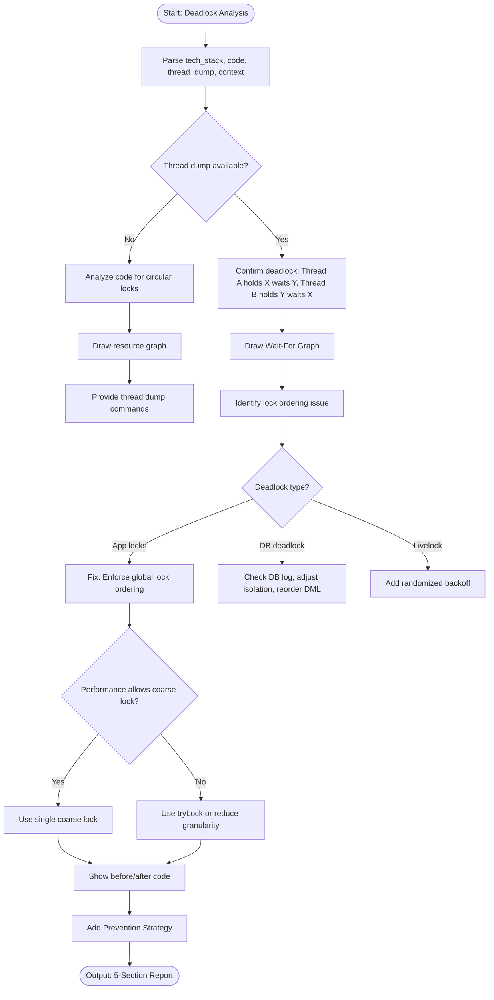

# Skill: Deadlock Analysis

## Purpose
Resolve thread deadlocks by analyzing lock order and thread dumps, identifying circular waits, and implementing consistent ordering or granularity fixes.

## Input
| Variable | Type | Req | Description |
|----------|------|-----|-------------|
| `tech_stack` | string | Yes | e.g., "Java + Spring" |
| `code` | string | Yes | Resource acquisition logic |
| `thread_dump` | string | No | Log of waiting threads |
| `context` | string | Yes | Types, counts, recent changes |

## Instructions
- **Identification**: Confirm circular wait (A holds X waits Y; B holds Y waits X).
- **Visualization**: Draw ASCII wait-for graph.
- **Diagnosis**: Explain why current ordering/logic creates the cycle.
- **Remediation**:
  - Enforce global lock ordering.
  - Transition to `tryLock` with timeouts.
  - Reduce lock granularity or use coarse locks.
- **Prevention**: Document lock hierarchies and convention rules.
- **Fallback**: If no dump, perform structural analysis and provide capture commands (e.g., `jstack`).

## Edge Cases
| Case | Strategy |
|------|----------|
| No Dump | Analyze circular dependencies in code; draw hypothetical resource graphs. |
| DB Deadlock | Check DB logs; adjust isolation levels; reorder DML statements. |
| Livelock | Recommend randomized backoff or retry jitter. |

## Deadlock Logic

## Examples
- [Input Example](@examples/input.md)
- [Output Example](@examples/output.md)

## Quality Gate
- [ ] Circular wait identified.
- [ ] Fix ordering consistent.
- [ ] Granularity right-sized.
- [ ] Prevention rules documented.
- [ ] Dump command accurate.

## MCP Dependencies
- `@modelcontextprotocol/server-sequential-thinking`: Complex reasoning.

## Changelog
| Version | Date | Description |
|---------|------|-------------|
| 1.1.0 | 2026-03-20 | Restructured: examples/references separated, added fields |
| 1.0.0 | 2026-03-20 | Initial release |
