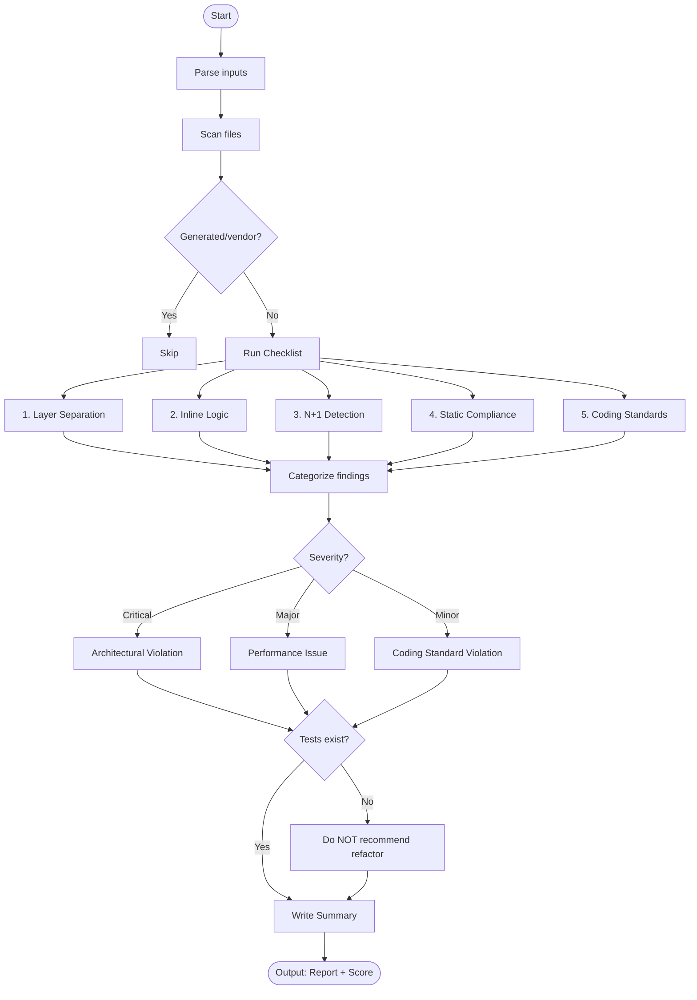

# Skill: Deep Audit

## Purpose
Systematically audit modules for architectural debt, N+1 issues, and coding standard violations before refactoring.

## Input
| Variable | Type | Req | Description |
|----------|------|-----|-------------|
| `module_name` | string | Yes | e.g., `OrderManagement` |
| `module_path` | string | Yes | Directory/File targets |
| `tech_stack` | string | Yes | Target technology stack |

## Instructions
- **Layer Check**: Flag violations of 5-layer principle (Controllers delegate; Services handle logic).
- **Logic Extraction**: Identify complex closures or queries in UI/Controller layers for extraction.
- **N+1 Detection**: Scan loops for repeated database or service calls missing eager-loading.
- **Compliance**: Verify Services/Handlers are `static`; check Slug-case Enums, i18n, and constants.
- **Reporting**: Categorize results into Architectural (Critical), Performance (Major), and Standard (Minor).
- **Summary**: Provide health score (0-10) and total violation counts.

## Edge Cases
| Case | Strategy |
|------|----------|
| Vendor Code | Skip; flag as out of scope. |
| No Tests | Flag violations; forbid refactor recommendations until tests are added. |
| Ambiguous Ownership | Provide trade-off analysis; recommend conservative placement. |

## Audit Workflow

## Quality Gate
- [ ] Violations severity-rated.
- [ ] Health score justified.
- [ ] Layer separation verified.
- [ ] N+1 fixes concrete.
- [ ] Audit scoped correctly.

## MCP Dependencies
- `@upstash/context7-mcp`: Library documentation and examples.
- `@modelcontextprotocol/server-sequential-thinking`: Complex reasoning.

## Changelog
| Version | Date | Description |
|---------|------|-------------|
| 1.1.0 | 2026-03-20 | Restructured: moved examples/references, added fields |
| 1.0.0 | 2026-03-20 | Initial release |
