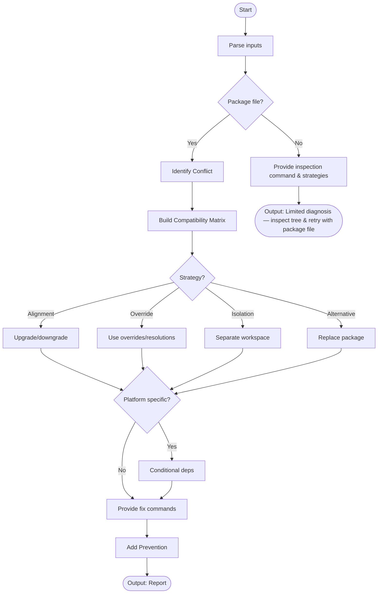

# Skill: Dependency Conflict Resolution

## Purpose
Resolve package manager conflicts by analyzing trees, building compatibility matrices, and providing lock file fixes.

## Input
| Variable | Type | Req | Description |
|----------|------|-----|-------------|
| `tech_stack` | string | Yes | e.g., "Node.js + npm" |
| `error_message` | string | Yes | The conflict log |
| `package_file` | string | Yes | `package.json`, `pyproject.toml`, etc. |
| `context` | string | Yes | Trigger (e.g., upgrade) |

## Instructions
- **Classification**: Identify overlapping vs. non-overlapping version requirements.
- **Matrix**: Map Package A | Package B | Shared Dep | Compatibility.
- **Strategy**: Use Alignment (Up/Downgrade), Overrides (`resolutions`), Isolation (Workspaces), or Replacement.
- **Fix**: Provide commands to regenerate lock files (e.g., `rm package-lock.json && npm install`).
- **Prevention**: Recommend major version pinning, CI audits, and automation (Renovate).
- **Fallback**: If no file, identify conflicting packages and provide tree inspection commands.

## Edge Cases
| Case | Strategy |
|------|----------|
| No package file | Provide tree inspection commands and generic resolution patterns. |
| Transitive Conflict | Map the dependency chain and apply top-level overrides. |
| OS Specific | Use conditional dependencies or platform shims. |

## Conflict Workflow

## Examples
- [Input Example](@examples/input.md)
- [Output Example](@examples/output.md)

## Quality Gate
- [ ] Overlapping range correctly identified.
- [ ] Resolution strategy justified.
- [ ] Fix commands provided for specific manager.
- [ ] Transitive deps mapped.
- [ ] Matrix is clear.

## MCP Dependencies
- `@upstash/context7-mcp`: Library documentation and examples.
- `@modelcontextprotocol/server-sequential-thinking`: Complex reasoning.

## Changelog
| Version | Date | Description |
|---------|------|-------------|
| 1.1.0 | 2026-03-20 | Restructured: moved examples/references, added fields |
| 1.0.0 | 2026-03-20 | Initial release |
