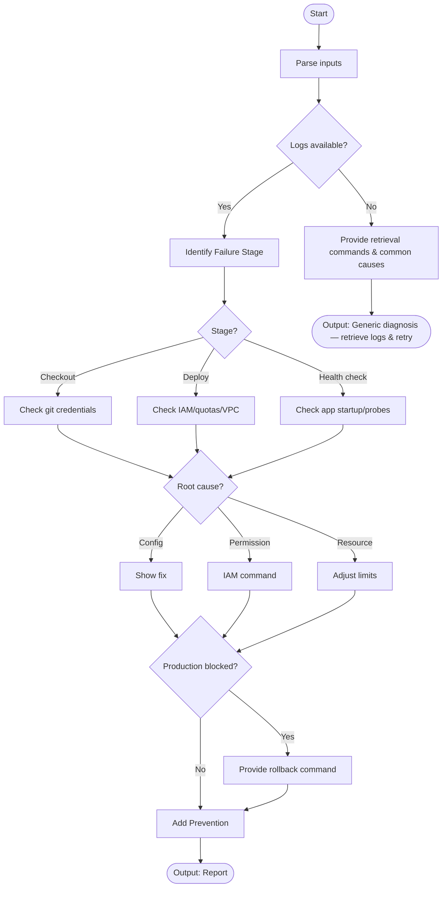

# Skill: Deployment Failure Diagnosis

## Purpose
Pinpoint deployment failure stages, identify root causes (Permissions, Config, Resources), and provide fixes or rollback steps.

## Input
| Variable | Type | Req | Description |
|----------|------|-----|-------------|
| `tech_stack` | string | Yes | e.g., "GitHub Actions + ECS" |
| `deployment_logs` | string | Yes | Pipeline output |
| `deployment_config` | string | Yes | CI YAML or Terraform |
| `context` | string | Yes | Recent infrastructure changes |

## Instructions
- **Stage ID**: Identify failing step (Checkout, Build, Push, Provision, Deploy, Health Check).
- **Classification**: Categorize as Config, Permission, Resource (OOM), Network, or App crash.
- **Remediation**: Provide targeted configuration snippets or CLI fix commands.
- **Rollback**: List immediate platform-specific recovery commands (e.g., `kubectl rollout undo`).
- **Prevention**: Recommend staging envs, smoke tests, and automated rollback triggers.
- **Fallback**: If no logs, provide retrieval commands and stage-by-stage checklist.

## Edge Cases
| Case | Strategy |
|------|----------|
| No Logs | Provide retrieval commands (`aws logs`, `kubectl logs`) and common stage failures. |
| "False" Success | Recommend post-deploy health probes and app-level log audits. |
| Flaky Deploys | Recommend increased health check grace periods and retry policies. |

## Diagnosis Logic

## Examples
- [Input Example](@examples/input.md)
- [Output Example](@examples/output.md)

## Quality Gate
- [ ] Failure stage pinpointed.
- [ ] Permissions (IAM) checked.
- [ ] Rollback command included.
- [ ] Fix is platform-specific.
- [ ] Health check addressed.

## MCP Dependencies
- `@upstash/context7-mcp`: Library documentation and examples.
- `@modelcontextprotocol/server-sequential-thinking`: Complex reasoning.

## Changelog
| Version | Date | Description |
|---------|------|-------------|
| 1.1.0 | 2026-03-20 | Restructured: moved examples/references, added fields |
| 1.0.0 | 2026-03-20 | Initial release |
