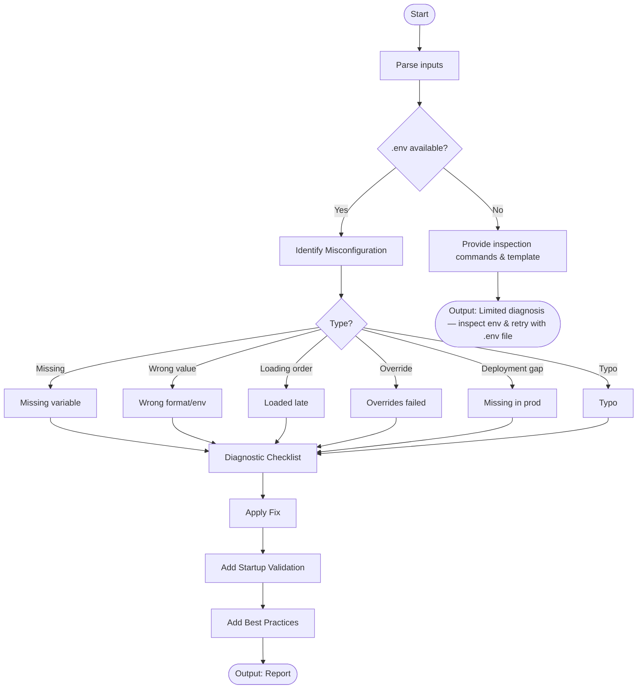

# Skill: Environment Variable Misconfiguration

## Purpose
Identify and resolve missing, invalid, or improperly loaded environment variables in any stack.

## Input
| Variable | Type | Req | Description |
|----------|------|-----|-------------|
| `tech_stack` | string | Yes | e.g., "Node.js + dotenv" |
| `error_message` | string | Yes | Error log |
| `env_file` | string | No | Redacted `.env` contents |
| `context` | string | Yes | Loading mechanism and env (Local/Prod) |

## Instructions
- **Identification**: Pinpoint issue (Missing var, wrong format, loading order, typo, prod/local gap).
- **Verification**: Check file path, loading timing, case-sensitivity, runtime injection, `.gitignore`.
- **Remediation**: Provide corrected `.env` and associated code changes.
- **Validation**: Implement fail-fast startup validation logic.
- **Best Practices**: Recommend `.env.example` and validation libraries (Zod/Envalid).
- **Fallback**: If no file, provide inspection commands and standard templates.

## Edge Cases
| Case | Strategy |
|------|----------|
| No file access | Provide inspection commands (`printenv`, `process.env` dump) and templates. |
| Format errors | Detect type requirements (JSON/URL/Port) and correct the value. |
| Loading precedence | Explain override order (e.g., Shell > `.env.local` > `.env`). |

## Diagnostic Workflow

## Examples
- [Input Example](@examples/input.md)
- [Output Example](@examples/output.md)

## Quality Gate
- [ ] Fail-fast validation included.
- [ ] Loading order verified.
- [ ] Format (URL/Type) correct.
- [ ] Security (gitignore) checked.
- [ ] Fix is stack-specific.

## MCP Dependencies
- `@upstash/context7-mcp`: Library documentation and examples.

## Changelog
| Version | Date | Description |
|---------|------|-------------|
| 1.1.0 | 2026-03-20 | Restructured: moved examples/references, added fields |
| 1.0.0 | 2026-03-20 | Initial release |
