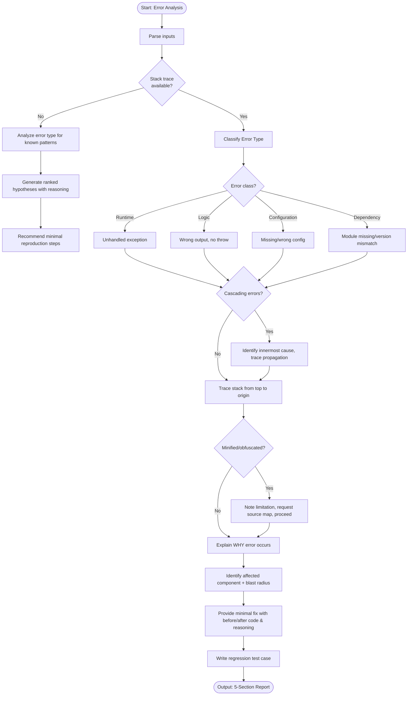

# Skill: Error Analysis

## Purpose
Rapidly triage error messages and stack traces to pinpoint root causes, affected modules, and regression fixes.

## Input
| Variable | Type | Req | Description |
|----------|------|-----|-------------|
| `tech_stack` | string | Yes | e.g., "Node.js + Postgres" |
| `error_message` | string | Yes | Full exception message |
| `stack_trace` | string | No | Raw stack output or symptoms |
| `context` | string | Yes | Relevant code or recent changes |

## Instructions
- **Classification**: Categorize as Runtime, Logic, Configuration, or Dependency error.
- **Trace**: Map stack from top frame to origin; explain the **WHY**.
- **Assessment**: Define affected component and blast radius/side effects.
- **Remediation**: Provide minimal fix with before/after code comparison.
- **Verification**: Write regression test case following local conventions.
- **Fallback**: If no trace, generate ranked hypotheses and reproduction steps.

## Edge Cases
| Case | Strategy |
|------|----------|
| No Trace | Analyze patterns; provide hypotheses and reproduction steps. |
| Minified Code | Request source maps; proceed with available info while noting limits. |
| Cascading Errors | Trace propagation to the innermost (original) cause. |

## Analysis Workflow

## Examples
- [Input Example](@examples/input.md)
- [Output Example](@examples/output.md)

## Quality Gate
- [ ] Root cause identified (not just symptom).
- [ ] Blast radius defined.
- [ ] Fix is minimal.
- [ ] Test is regression-proof.
- [ ] Minification limits noted.

## MCP Dependencies
- `@upstash/context7-mcp`: Library documentation and examples.
- `@modelcontextprotocol/server-sequential-thinking`: Complex reasoning.

## Changelog
| Version | Date | Description |
|---------|------|-------------|
| 1.1.0 | 2026-03-20 | Restructured: moved examples/references, added compatibility/license |
| 1.0.0 | 2026-03-20 | Initial release |
