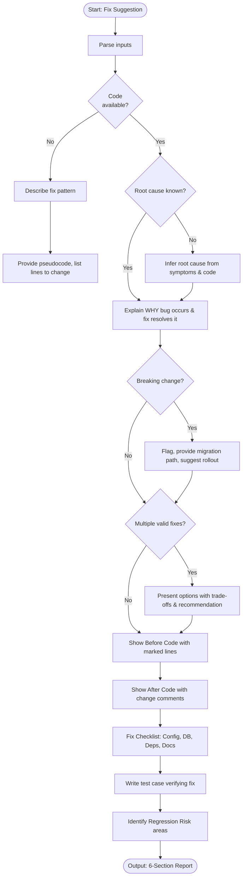

# Skill: Fix Suggestion

## Purpose
Produce surgical bug fixes with before/after comparisons and regression-preventing test cases.

## Input
| Variable | Type | Req | Description |
|----------|------|-----|-------------|
| `tech_stack` | string | Yes | e.g., "TypeScript + NestJS" |
| `bug_description`| string | Yes | Behavior and impact |
| `code` | string | Yes | The buggy logic |
| `root_cause` | string | Yes | Confirmed origin of the issue |

## Instructions
- **Explanation**: Clarify why fix resolves root cause; detail side effects/trade-offs.
- **Before/After**: Show original logic (marked) vs. fixed logic (explained).
- **Checklist**: List non-code requirements (Migrations, Config, Deps, Docs).
- **Validation**: Provide minimal test reproducing bug and verifying fix.
- **Risk Assessment**: Identify areas needing re-testing for regressions.
- **Fallback**: If no code, provide structural fix patterns and target logic.

## Edge Cases
| Case | Strategy |
|------|----------|
| No Code provided | Provide fix patterns and pseudocode for the bug type. |
| Breaking Change | Flag explicitly; suggest migration path or feature flags. |
| Multi-Fix options | Present options with trade-off analysis and recommendation. |

## Fix Flow

## Examples
- [Input Example](@examples/input.md)
- [Output Example](@examples/output.md)

## Quality Gate
- [ ] Fix is minimal.
- [ ] Behavior preserved (except fix).
- [ ] Test is regression-proof.
- [ ] Side effects noted.
- [ ] Fix is idiomatic.

## MCP Dependencies
- `@upstash/context7-mcp`: Library documentation and examples.
- `@modelcontextprotocol/server-sequential-thinking`: Complex reasoning.

## Changelog
| Version | Date | Description |
|---------|------|-------------|
| 1.1.0 | 2026-03-20 | Restructured: moved examples/references, added compatibility/license |
| 1.0.0 | 2026-03-20 | Initial release |
