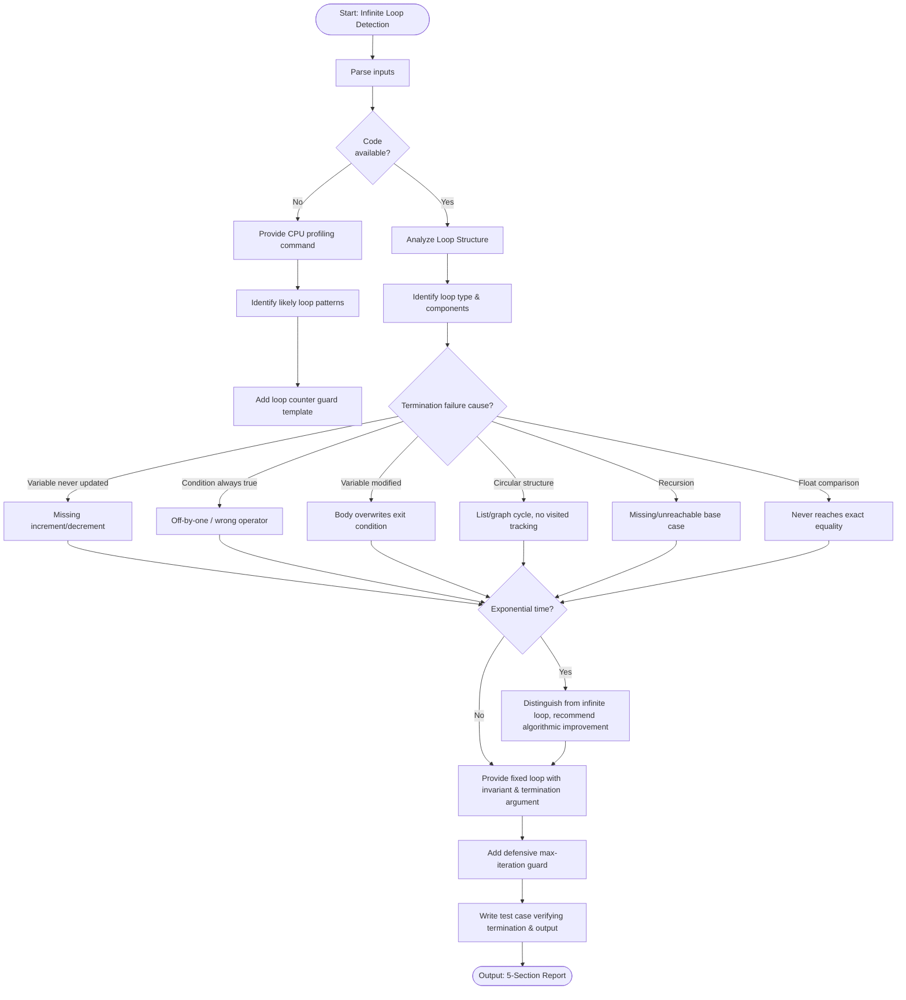

# Skill: Infinite Loop Detection

## Purpose
Identify infinite loop conditions by analyzing structure, termination condition, and invariants.

## Input
| Variable | Type | Req | Description |
|----------|------|-----|-------------|
| `tech_stack` | string | Yes | e.g., "JavaScript + Node.js" |
| `code` | string | Yes | Loop code or function |
| `symptoms` | string | Yes | 100% CPU, hang, timeout, stack overflow |
| `context` | string | Yes | Input data, recent changes |

## Instructions
- **Identification**: Pinpoint failure cause (Var not updated, condition always true, circular structure, missing base case).
- **Analysis**: Identify loop type and components (Init, Condition, Update, Termination invariant).
- **Remediation**:
  - Provide fixed loop with marked fix comment.
  - Add Loop Invariant: "At the start of each iteration, [property] holds".
  - Define Termination Argument: "[Measure] strictly decreases".
- **Defensive Guard**: Add a max-iteration guard template.
- **Verification**: Write test verifying termination within reasonable time/iterations.
- **Fallback**: If no code, provide CPU profiling commands and counter guard templates.

## Edge Cases
| Case | Strategy |
|------|----------|
| No Code | Activate fallback path; provide profiling and guards. |
| Exponential Time | Distinguish from infinite loops; recommend algorithmic improvements. |
| Third-party | Identify triggering input, provide workaround, recommend upstream issue. |

## Workflow

## Examples
- [Input Example](@examples/input.md)
- [Output Example](@examples/output.md)

## Quality Gate
- [ ] Solution is minimal.
- [ ] Failure modes handled.
- [ ] Output is testable/observable.
- [ ] Loop invariant defined.
- [ ] Termination argument provided.

## MCP Dependencies
- `@modelcontextprotocol/server-sequential-thinking`: Complex reasoning.

## Changelog
| Version | Date | Description |
|---------|------|-------------|
| 1.1.0 | 2026-03-20 | Restructured: moved examples/references, added compatibility/license |
| 1.0.0 | 2026-03-20 | Initial release |
