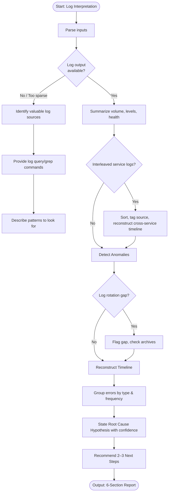

# Skill: Log Interpretation

## Purpose
Parse application log output to surface anomalies, identify error patterns, reconstruct event timelines, and produce root cause hypotheses.

## Input
| Variable | Type | Req | Description |
|----------|------|-----|-------------|
| `tech_stack` | string | Yes | e.g., "Node.js + Elasticsearch" |
| `log_output` | string | Yes | Raw log lines or sample |
| `time_range` | string | Yes | e.g., "2025-01-15 14:00–14:30 UTC" |
| `context` | string | Yes | Traffic spikes, user reports, changes |

## Instructions
- **Log Summary**: Summarize volume, levels (DEBUG/INFO/WARN/ERROR), and overall health.
- **Anomaly Detection**: Identify error storms, unexpected silence, latency outliers, or auth failures.
- **Timeline**: Reconstruct chronological event sequence: `[timestamp] [event] [description]`.
- **Pattern Analysis**: Group errors by frequency and likely trigger.
- **Root Cause**: State likely cause based on evidence; rate confidence (High/Med/Low).
- **Remediation**: List 2–3 specific actions to confirm or gather more evidence.
- **Fallback**: If no logs, provide query/grep commands for common systems (Datadog, ELK).

## Edge Cases
| Case | Strategy |
|------|----------|
| No Logs | Activate fallback; provide query commands and patterns to look for. |
| Interleaved Logs | Sort by timestamp, tag entries by source, and reconstruct cross-service timeline. |
| Rotation Gap | Flag gaps explicitly; recommend checking rotated log archives. |

## Workflow

## Examples
- [Input Example](@examples/input.md)
- [Output Example](@examples/output.md)

## Quality Gate
- [ ] Confirmed vs inferred evidence distinguished.
- [ ] Timeline is chronological.
- [ ] Hypotheses are evidence-based.
- [ ] Confidence rating provided.
- [ ] Volume/levels summarized.

## Changelog
| Version | Date | Description |
|---------|------|-------------|
| 1.1.0 | 2026-03-20 | Restructured: moved examples/references, added compatibility/license |
| 1.0.0 | 2026-03-20 | Initial release |
