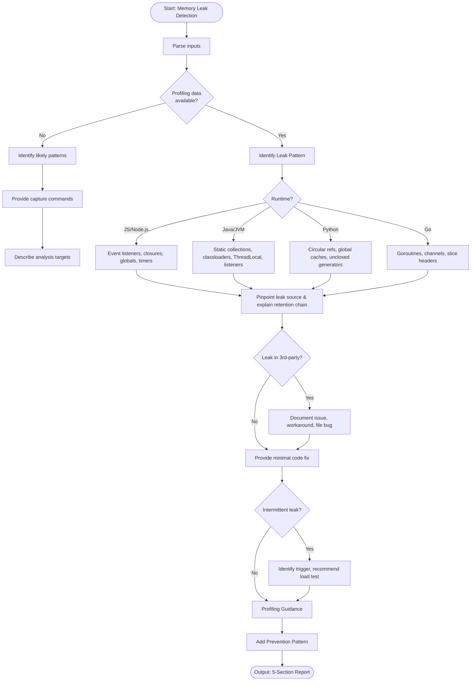

# Skill: Memory Leak Detection

## Purpose
Identify memory leak patterns (event listeners, unclosed resources, growing caches), pinpoint sources via profiling, and provide fixes.

## Input
| Variable | Type | Req | Description |
|----------|------|-----|-------------|
| `tech_stack` | string | Yes | e.g., "Node.js + Express" |
| `code` | string | Yes | Suspected module or lifecycle description |
| `symptoms` | string | Yes | Memory growth rate, crash frequency |
| `profiling_data` | string | No | Heap snapshot, profiler output |

## Instructions
- **Identification**: Categorize pattern (Accumulation, closure captures, timer leaks, goroutine leaks).
- **Source**: Pinpoint exact location (file/line) and explain retention chain (prevented GC).
- **Remediation**: Provide minimal fix with before/after comparison to break retention chain.
- **Profiling**: Provide commands to capture baseline vs load snapshots (e.g., `jmap`, `tracemalloc`).
- **Prevention**: Describe patterns to prevent the leak class (e.g., `try-with-resources`, `WeakMap`).
- **Fallback**: If no profiling, identify top 3 patterns for stack and provide capture instructions.

## Edge Cases
| Case | Strategy |
|------|----------|
| No Profiling | Identify likely patterns; provide step-by-step capture instructions. |
| Third-party | Document issue, provide workaround (e.g., pooling), recommend upstream bug. |
| Intermittent | Identify trigger; recommend load test for reliable reproduction. |

## Workflow

## Examples
- [Input Example](@examples/input.md)
- [Output Example](@examples/output.md)

## Quality Gate
- [ ] Retention chain explained.
- [ ] Fix is minimal.
- [ ] Profiling commands provided.
- [ ] Prevention pattern included.
- [ ] Stack-specific patterns used.

## MCP Dependencies
- `@modelcontextprotocol/server-sequential-thinking`: Complex reasoning.

## Changelog
| Version | Date | Description |
|---------|------|-------------|
| 1.1.0 | 2026-03-20 | Restructured: moved examples/references, added compatibility/license |
| 1.0.0 | 2026-03-20 | Initial release |
