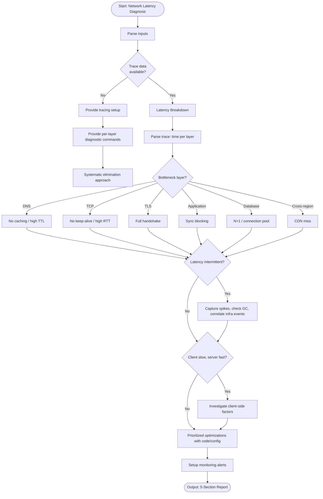

# Skill: Network Latency Diagnosis

## Purpose
Diagnose network latency via distributed traces to identify bottleneck layers (DNS, TCP, TLS, App) and provide optimizations.

## Input
| Variable | Type | Req | Description |
|----------|------|-----|-------------|
| `tech_stack` | string | Yes | e.g., "Node.js + AWS + Datadog" |
| `latency_symptoms`| string | Yes | p99 latency, affected endpoints |
| `trace_data` | string | No | Distributed trace, waterfall chart |
| `context` | string | Yes | Arch, region, traffic patterns |

## Instructions
- **Breakdown**: Parse trace for time per layer (DNS, TCP, TLS, TTFB, Service, Downstream).
- **Identification**: Classify bottleneck (Infrastructure, App processing, Downstream, Network path).
- **Root Cause**: Explain cause (TTL overload, no keep-alive, handshake overhead, N+1, CDN miss).
- **Remediation**: Provide prioritized fixes for bottlenecks (config, code, infrastructure).
- **Monitoring**: Recommend metrics/alerts for early regression detection.
- **Fallback**: If no trace, provide layer commands (`dig`, `mtr`, `openssl`, `curl -w`) and elimination approach.

## Edge Cases
| Case | Strategy |
|------|----------|
| No Trace | Activate fallback; provide layer-specific diagnostic commands. |
| Intermittent | Recommend spike tracing, checking GC, correlating infra events. |
| Client-side | Investigate browser rendering, last-mile network, JS blocking. |

## Workflow

## Examples
- [Input Example](@examples/input.md)
- [Output Example](@examples/output.md)

## Quality Gate
- [ ] Latency breakdown is quantified.
- [ ] Bottleneck layer pinpointed.
- [ ] Prioritized fixes provided.
- [ ] Monitoring metrics defined.
- [ ] Elimination steps clear.

## Changelog
| Version | Date | Description |
|---------|------|-------------|
| 1.1.0 | 2026-03-20 | Restructured: moved examples/references, added compatibility/license |
| 1.0.0 | 2026-03-20 | Initial release |
