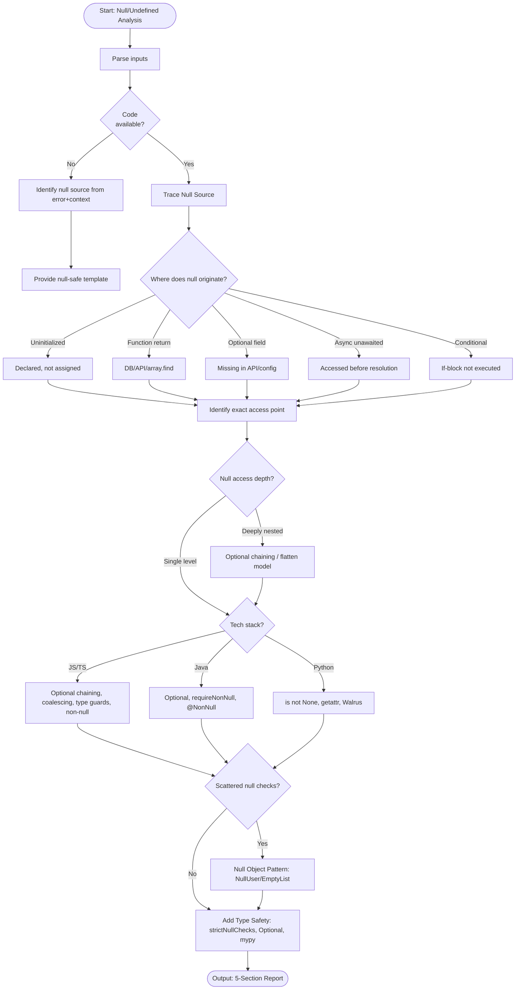

# Skill: Null Pointer / Undefined Analysis

## Purpose
Resolve null and undefined reference errors by identifying the source and applying defensive patterns.

## Input
| Variable | Type | Req | Description |
|----------|------|-----|-------------|
| `tech_stack` | string | Yes | e.g., "TypeScript + React" |
| `error_message` | string | Yes | Full error + failing property |
| `code` | string | Yes | Failing section or flow |
| `context` | string | Yes | Source of null (API, DB, input) |

## Instructions
- **Source Identification**: Trace origin (Uninitialized, function return, missing field, unawaited async).
- **Access Point**: Identify failing line and explain WHY it fails (property/method on null).
- **Defensive Fix**: Apply appropriate stack pattern:
  - **JS/TS**: `?.`, `??`, type guards.
  - **Java**: `Optional<T>`, `requireNonNull`, `@NonNull`.
  - **Python**: `is not None`, `getattr()`, Walrus operator.
- **Null Object Pattern**: Recommend `NullUser` or `NoOpHandler` if checks are scattered.
- **Type Safety**: Recommend improvements (e.g., `strictNullChecks`, `Optional[T]`).
- **Fallback**: If no code, trace likely source from error and provide stack templates.

## Edge Cases
| Case | Strategy |
|------|----------|
| No Code | Activate fallback; provide likely source and null-safe templates. |
| External API | Recommend defensive deserialization and document contract violation. |
| Deep Nested | Recommend flattening access or optional chaining. |

## Workflow

## Examples
- [Input Example](@examples/input.md)
- [Output Example](@examples/output.md)

## Quality Gate
- [ ] Source identified (not just point).
- [ ] Fix is stack-specific.
- [ ] Before/after code included.
- [ ] Type safety improvement noted.
- [ ] Simple patterns preferred.

## Changelog
| Version | Date | Description |
|---------|------|-------------|
| 1.1.0 | 2026-03-20 | Restructured: moved examples/references, added compatibility/license |
| 1.0.0 | 2026-03-20 | Initial release |
