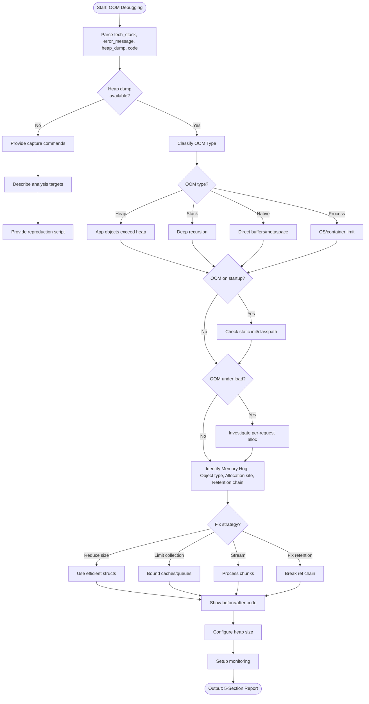

# Skill: OOM Debugging

## Purpose
Debug out-of-memory errors via heap dumps and metrics to identify hogs and provide fixes.

## Input
| Variable | Type | Req | Description |
|----------|------|-----|-------------|
| `tech_stack` | string | Yes | e.g., "Node.js", "Java" |
| `error_message` | string | Yes | OOM message |
| `heap_dump` | string | No | Top retained objects/metrics |
| `code` | string | No | Suspected section or operation |

## Instructions
- **Classification**: Identify OOM type (Heap, Stack/Recursion, Native/Metaspace, Process/Container).
- **Hog Identification**: Find object type, allocation site, and retention chain from heap dump.
- **Remediation**:
  - Reduce object size/efficient structs.
  - Limit collection size (bound caches/queues).
  - Stream/Chunk processing.
  - Break reference chains.
- **Configuration**: Provide stack-specific heap flags (e.g., `-Xmx4g`, `--max-old-space-size`).
- **Monitoring**: Recommend thresholds (>80%), periodic snapshots, and GC pause tracking.
- **Fallback**: If no heap dump, identify likely cause and provide capture commands (`jmap`, `SIGUSR2`).

## Edge Cases
| Case | Strategy |
|------|----------|
| No Heap Dump | Activate fallback; provide capture commands and reproduction script. |
| Startup OOM | Check static initializers, classpath scanning, or large config loading. |
| Load-only OOM | Investigate per-request alloc; recommend load test with heap monitoring. |

## Workflow

## Examples
- [Input Example](@examples/input.md)
- [Output Example](@examples/output.md)

## Quality Gate
- [ ] OOM type classified.
- [ ] Hog identified via retention chain.
- [ ] Fix provided with before/after.
- [ ] Heap flags provided.
- [ ] Alerting strategy included.

## MCP Dependencies
- `@modelcontextprotocol/server-sequential-thinking`: Complex reasoning.

## Changelog
| Version | Date | Description |
|---------|------|-------------|
| 1.1.0 | 2026-03-20 | Restructured: moved examples/references, added compatibility/license |
| 1.0.0 | 2026-03-20 | Initial release |
