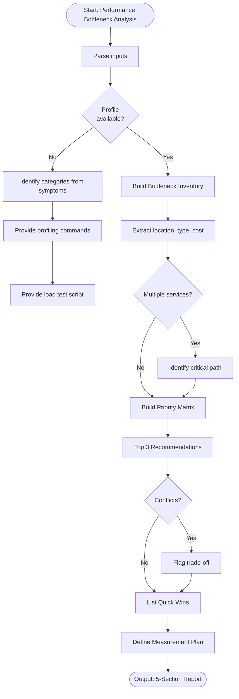

# Skill: Performance Bottleneck Analysis

## Purpose
Analyze performance profiles/metrics to identify and prioritize top bottlenecks (CPU, I/O, memory, network).

## Input
| Variable | Type | Req | Description |
|----------|------|-----|-------------|
| `tech_stack` | string | Yes | e.g., "Go + PostgreSQL" |
| `performance_profile` | string | Yes | Profiler output, APM trace |
| `code` | string | No | Hot path section/module |
| `context` | string | Yes | Traffic, SLA targets, changes |

## Instructions
- **Inventory**: List bottlenecks with location, type, and current cost (% time/latency).
- **Prioritization**: Rank by Impact × Effort using a Priority Matrix table.
- **Remediation**: Provide top 3 recommendations with root cause, technique, and before/after snippets.
- **Quick Wins**: List <1 hour optimizations with high confidence.
- **Measurement**: Define tracking metrics, baselines, and post-optimization targets.
- **Fallback**: If no profile, identify likely categories from symptoms and provide profiling commands.

## Edge Cases
| Case | Strategy |
|------|----------|
| No Profile | Activate fallback; provide stack-specific profiling and load test commands. |
| Multi-Service | Identify critical path; prioritize highest-latency service. |
| Conflicts | Flag trade-offs (e.g., cache vs real-time); align with SLA. |

## Workflow

## Examples
- [Input Example](@examples/input.md)
- [Output Example](@examples/output.md)

## Quality Gate
- [ ] Priority Matrix ranked correctly.
- [ ] Quantified improvements provided.
- [ ] Before/after snippets included.
- [ ] SLA targets addressed.
- [ ] Quick wins distinguished.

## Changelog
| Version | Date | Description |
|---------|------|-------------|
| 1.1.0 | 2026-03-20 | Restructured: moved examples, references, added metadata |
| 1.0.0 | 2026-03-20 | Initial release |
