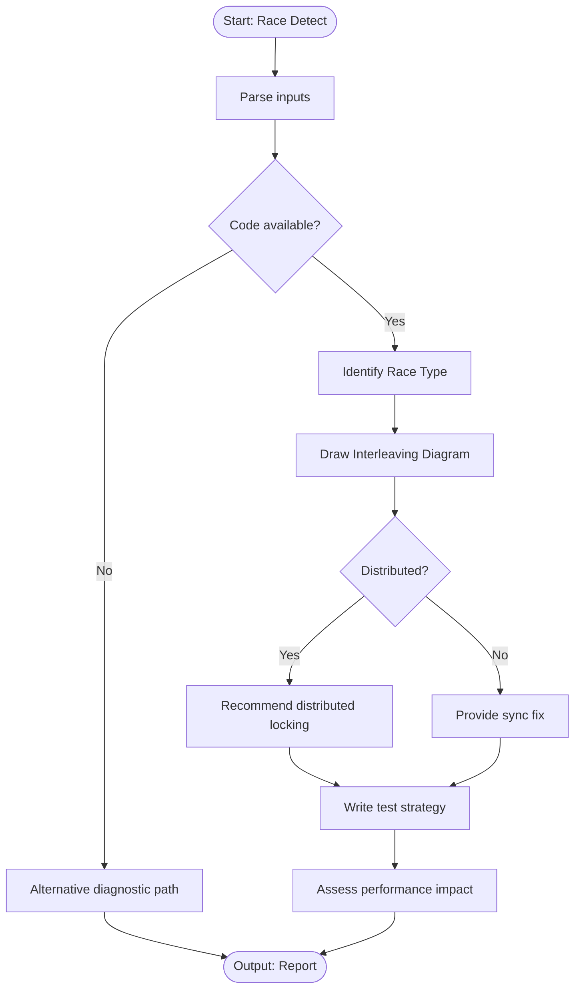

# Skill: Race Condition Detection

## Purpose
Identify race conditions by analyzing code structure and timing patterns, providing synchronization fixes.

## Input
| Variable | Type | Req | Description |
|----------|------|-----|-------------|
| `tech_stack` | string | Yes | Target tech stack |
| `code` | string | Yes | Concurrent code section |
| `symptoms` | string | Yes | Observable symptoms |
| `context` | string | Yes | Concurrency model and state |

## Instructions
- **Identification**: Categorize type (Check-then-act, Read-modify-write, Lazy init, Iterator invalidation).
- **Analysis**: Describe sequence using a thread interleaving diagram.
- **Remediation**:
  - Apply synchronization primitive (Mutex, Atomics, Channels, CAS, Immutability).
  - Show before/after code.
  - Explain strategy rationale.
- **Verification**: Provide stress tests, detector commands, and assertions.
- **Impact**: Assess performance cost; suggest optimizations (e.g., RW locks).
- **Fallback**: If no code, identify patterns from symptoms and provide shared-state descriptions.

## Edge Cases
| Case | Strategy |
|------|----------|
| No Code | Identify likely patterns; provide reproduction templates and detector commands. |
| Third-party | Document issue, provide wrapper workaround, recommend filing bug. |
| Distributed | Recommend distributed locking (Redis/DB) over in-process sync. |

## Workflow

## Examples
- [Input Example](@examples/input.md)
- [Output Example](@examples/output.md)

## Quality Gate
- [ ] Race type correctly identified.
- [ ] Interleaving diagram included.
- [ ] Primitive choice justified.
- [ ] Stress test strategy provided.
- [ ] Performance impact assessed.

## Changelog
| Version | Date | Description |
|---------|------|-------------|
| 1.1.0 | 2026-03-20 | Restructured: moved examples, references, added fields |
| 1.0.0 | 2026-03-20 | Initial release |
