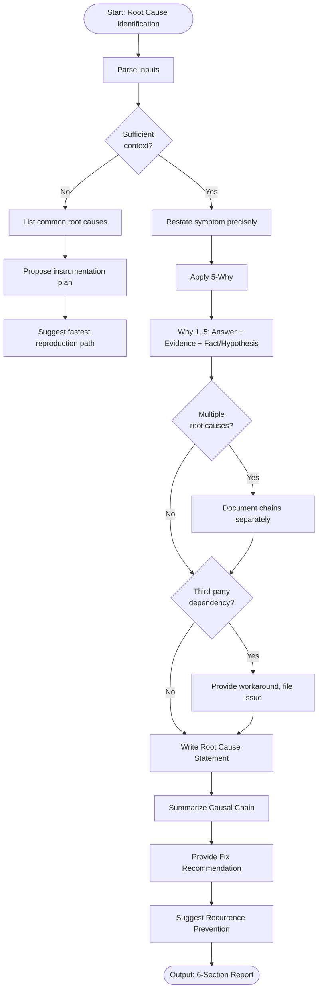

# Skill: Root Cause Identification

## Purpose
Trace bugs from observable symptoms to true origins using structured causal analysis (5-Why). Produce a causal chain, root cause statement, and origin-targeted fix to prevent recurrence.

## Input
| Variable | Type | Required | Description |
|----------|------|----------|-------------|
| `{{tech_stack}}` | string | yes | Target tech stack (e.g., "Java + Spring") |
| `{{bug_description}}` | string | yes | Observable symptom or bug behavior |
| `{{symptoms}}` | string | yes | Additional errors, logs, metrics, reports |
| `{{context}}` | string | yes | Relevant code, architecture, recent changes |

## Prompt
> **Anti-Hallucination:** Follow `.agents/rules/anti-hallucination.md`. Show chain-of-thought. State assumptions. Say "I don't know" if uncertain. Use only provided context.

You are a senior software engineer conducting a root cause analysis.

Tech stack: {{tech_stack}}
Bug description: {{bug_description}}
Additional symptoms: {{symptoms}}
Context: {{context}}

**If symptoms vague or no logs available**, apply alternative diagnostic path:
1. List common root causes for this bug class in {{tech_stack}}.
2. Propose minimal instrumentation plan (what to log/measure).
3. Suggest fastest reproduction path to isolate variables.

**If sufficient context available**, apply full 5-Why analysis:

**1. Symptom Statement**
Restate observable symptom technically. Separate observed from assumed.

**2. 5-Why Causal Chain**
For each "why":
- Answer (next-level cause)
- Evidence/reasoning
- Mark as confirmed fact or hypothesis
Stop at process failure, design decision, or environmental condition — not just another code bug.

**3. Root Cause Statement**
Single precise sentence: "The root cause is [X] because [Y], which allowed [Z] to occur."

**4. Causal Chain Summary**
Numbered list from symptom to root cause.

**5. Fix Recommendation**
Provide fix addressing root cause, not just symptom. Explain recurrence prevention. Include necessary process/architecture changes.

**6. Recurrence Prevention**
Suggest one monitoring, alerting, or testing measure to catch this bug class earlier.

## Examples

@examples/input.md
@examples/output.md

## Edge Cases
1. **Insufficient context**: Use alternative path (instrumentation, reproduction steps).
2. **Multiple concurrent root causes**: Document both chains separately, recommend fixing both.
3. **Third-party dependency root cause**: Document failure, provide workaround, suggest filing upstream issue.

## Output Format
6 numbered sections with markdown headers. Section 2 uses Why→Answer structure. Section 4 is a numbered list. Use fenced code blocks with language tags. Total: 400–700 words.

## Senior Review Checklist
1. Simplest solution?
2. Failure modes handled?
3. Scales to 10x?
4. Security implications addressed?
5. Testable/observable in production?

## Changelog
| Version | Date | Description |
|---------|------|-------------|
| 1.1.0 | 2026-03-20 | Restructured: moved examples, references, added metadata |
| 1.0.0 | 2026-03-20 | Initial release |

## MCP Dependencies

- `@modelcontextprotocol/server-sequential-thinking` — Multi-step reasoning
- `@modelcontextprotocol/server-memory` — Knowledge graph memory

## Mermaid Diagram

