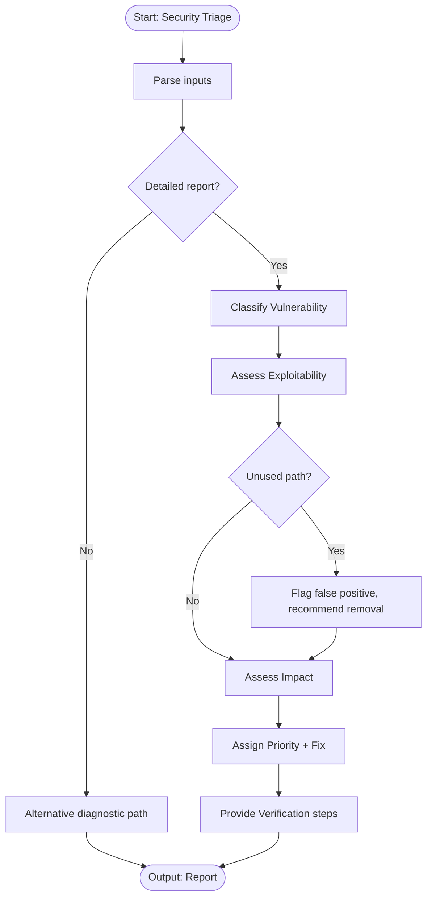

# Skill: Security Vulnerability Triage

## Purpose
Triages security vulnerabilities via CVSS scoring and contextual exploitability assessment. Prioritizes remediation and provides concrete fixes for CVEs, SAST findings, and pentest results.

## Input
| Variable | Type | Required | Description |
|----------|------|----------|-------------|
| `{{tech_stack}}` | string | yes | Application stack |
| `{{vulnerability_report}}` | string | yes | Report details |
| `{{codebase_context}}` | string | yes | Component usage context |
| `{{context}}` | string | yes | Deployment/environment context |

## Prompt
> **Anti-Hallucination:** Follow `.agents/rules/anti-hallucination.md`. Show reasoning. State assumptions. Say "I don't know" if uncertain. Use only provided context.

Act as a senior application security engineer triaging a vulnerability.

Stack: {{tech_stack}}
Report: {{vulnerability_report}}
Codebase context: {{codebase_context}}
Deployment context: {{context}}

**If report is sparse**:
1. Look up CVSS score and attack vector based on CVE/type.
2. Describe vulnerability class and exploitability.
3. Provide code patterns to search for.
4. List standard remediation approaches.

**If report is detailed**:

**1. Vulnerability Classification**
Identify type, CVE ID, CVSS score, affected component, and attack vector.

**2. Exploitability Assessment**
Assess contextual exploitability (reachability, input control, mitigations, realistic scenarios). Rate: Critical / High / Medium / Low / Informational.

**3. Impact Assessment**
Assess impact on confidentiality, integrity, availability, and scope.

**4. Remediation Priority and Fix**
Assign priority (P0: 24h, P1: 7d, P2: 30d, P3: next sprint). Provide concrete fix (commands, before/after code, config).

**5. Verification**
Provide test cases, scanner commands, or manual test steps.

## Examples

@examples/input.md
@examples/output.md

## Edge Cases
1. **Sparse report**: Activate alternative diagnostic path.
2. **Unused code path**: Document mitigation, reduce rating, recommend code removal.
3. **SAST false positive**: Document mitigations, explain false positive, recommend suppression comment.

## Output Format
Five numbered sections. Section 4 includes before/after code/commands. Section 2 includes rating. 500–800 words.

## Senior Review Checklist
1. Is this solution the simplest that could work?
2. What are the failure modes and how are they handled?
3. How does this scale to 10x load or 10x codebase size?
4. Are there security implications that need to be addressed?
5. Is the output testable and observable in production?

## Changelog
| Version | Date | Description |
|---------|------|-------------|
| 1.1.0 | 2026-03-20 | Restructured: moved examples, references, added fields |
| 1.0.0 | 2026-03-20 | Initial release |

## MCP Dependencies
- `@modelcontextprotocol/server-sequential-thinking`
- `@modelcontextprotocol/server-memory`

## Mermaid Diagram

