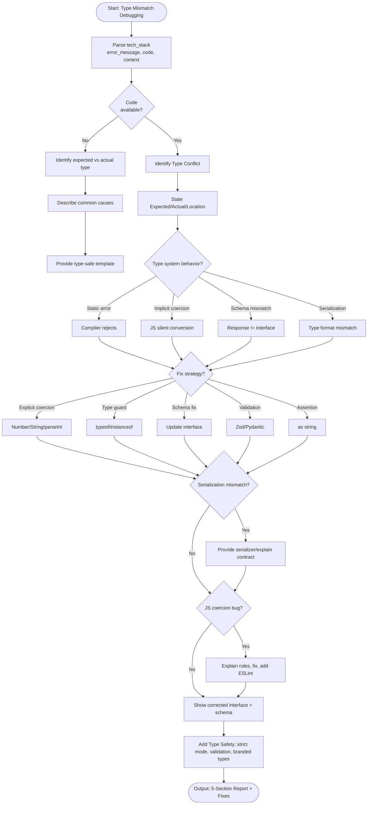

# Skill: Type Mismatch Debugging

## Purpose
Resolve type mismatch errors by identifying conflicts, explaining behavior, and applying fixes (coercion, schema correction, guards).

## Input
| Variable | Type | Req | Description |
|----------|------|-----|-------------|
| `tech_stack` | string | Yes | e.g., "TypeScript + Zod" |
| `error_message` | string | Yes | Full message with expected/actual |
| `code` | string | Yes | Failing code or flow |
| `context` | string | Yes | Data source and expected type |

## Instructions
- **Identification**: State expected/actual types and mismatch location (parameter, return, schema).
- **Behavior Analysis**: Explain rejection/runtime behavior (Static reject, implicit coercion, serialization mismatch).
- **Remediation**:
  - Apply explicit coercion (`Number()`), type guards (`typeof`), or schema fixes.
  - Show before/after code.
- **Schema Alignment**: If API response mismatch, provide corrected interface and validation schema (Zod/Pydantic).
- **Prevention**: Recommend strict mode, boundary validation, or branded types.
- **Fallback**: If no code, identify cause from error and provide type-safe templates.

## Edge Cases
| Case | Strategy |
|------|----------|
| No Code | Identify mismatch from error; provide common causes and templates. |
| Serialization | Provide custom serializer/deserializer; explain contract. |
| JS Coercion | Explain rules; provide explicit fix; recommend ESLint rules. |

## Workflow

## Examples
- [Input Example](@examples/input.md)
- [Output Example](@examples/output.md)

## Quality Gate
- [ ] Expected/Actual types stated.
- [ ] Fix choice explained.
- [ ] Before/after code included.
- [ ] Runtime validation added (if applicable).
- [ ] Prevention strategy stack-specific.

## Changelog
| Version | Date | Description |
|---------|------|-------------|
| 1.1.0 | 2026-03-20 | Restructured: moved examples, references, added metadata |
| 1.0.0 | 2026-03-20 | Initial release |
