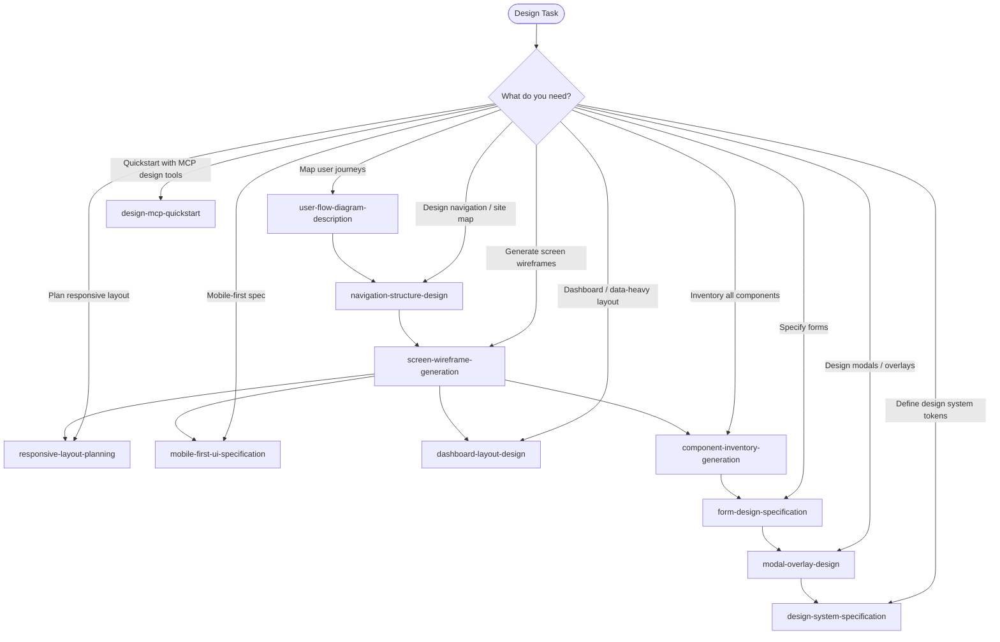

# Skills: Design (11 skills)

This category contains skills for UI/UX design and component specification.

## Subdirectory Structure

Each skill in the `design` category has the following structure:

```
{skill-name}/
├── SKILL.md          # Core instructions (≤500 lines)
├── references/       # Supporting technical documentation
│   ├── README.md
│   └── compatibility-matrix.md
├── assets/           # Component/layout specification templates
│   └── template.md
└── examples/         # Concrete input/output examples
    ├── input.md
    └── output.md
```

## Skills

| Skill | Description |
|-------|-------------|
| `component-inventory-generation` | Generate UI component inventories |
| `dashboard-layout-design` | Design dashboard layouts |
| `design-mcp-quickstart` | Quickstart for design with MCP tools |
| `design-system-specification` | Specify design systems |
| `form-design-specification` | Specify form designs |
| `mobile-first-ui-specification` | Specify mobile-first UIs |
| `modal-overlay-design` | Design modals and overlays |
| `navigation-structure-design` | Design navigation structures |
| `responsive-layout-planning` | Plan responsive layouts |
| `screen-wireframe-generation` | Generate screen wireframes |
| `user-flow-diagram-description` | Describe user flow diagrams |

---

## Mermaid Diagram


