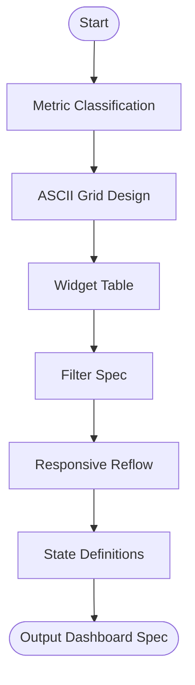

# Skill: Dashboard Layout Design

## Purpose
Generates complete dashboard layout specifications including grid, widgets, filters, and state logic.

## Input
| Variable | Type | Required | Description |
|----------|------|----------|-------------|
| `{{dashboard_name}}` | string | yes | Name of dashboard |
| `{{primary_audience}}` | string | yes | Target users and their goal |
| `{{key_metrics}}` | string | yes | Comma-separated metrics |
| `{{data_refresh_rate}}` | string | yes | Data update frequency |
| `{{framework}}` | string | yes | Frontend framework and chart library |

## Prompt
- **Grid (ASCII)**: 1440px desktop grid layout with filter bar and legend.
- **Widget Inventory**: Table (Name, Metric, Viz Type, Dimensions, Source, States).
- **Filter Bar**: List (Control Name, Type, Default, Effect, Trigger).
- **Responsive Behavior**: Rules for Desktop (grid), Tablet (collapse), Mobile (stack/hide).
- **States**: Specs for Loading (skeletons), Empty (CTAs), Error (retry), Stale.

## Rules
- Use specific types (Line, Bar, KPI, Heatmap).
- Stale indicators based on `{{data_refresh_rate}}`.
- No metric invention.

## Edge Cases
| Case | Strategy |
|------|----------|
| Single Metric | Layout multiple perspectives (KPI, trend, breakdown). |
| High Density | If >8 real-time metrics, recommend staggered refresh/WebSockets. |
| Complex Viz | Specify mobile replacements (e.g., summary cards). |

## Output Format
- Five sections (`##`).
- ASCII grid + 7-column widget table.
- Breakpoint and state lists.

## MCP Tools
| Tool | Server | Use Case |
|------|--------|----------|
| Figma | `figma-mcp` | Create frames with 12-col grid. |
| Google Stitch | `google-stitch-mcp` | Generate rapid UI mockups. |

## Senior Review Checklist
- [ ] Simplest working grid?
- [ ] Stale/Empty states addressed?
- [ ] Mobile fallbacks for complex viz included?
- [ ] Metric-viz alignment correct?

## Changelog
| Version | Date | Description |
|---------|------|-------------|
| 1.1.0 | 2026-03-20 | Condensed format. |
| 1.0.0 | 2026-03-20 | Initial release. |

## Mermaid Diagram

