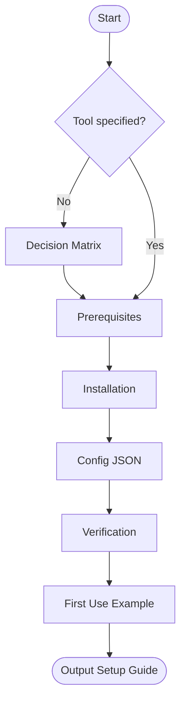

# Skill: Design MCP Quickstart

## Purpose
Guides developers through selecting, installing, and configuring design MCP tools.

## Input
| Variable | Type | Required | Description |
|----------|------|----------|-------------|
| `{{agent_environment}}` | string | yes | AI agent/IDE (e.g., "Cursor") |
| `{{design_tool}}` | string | yes | Tool name or "help me choose" |
| `{{use_case}}` | string | yes | Intended use case |
| `{{os}}` | string | yes | Operating system |

## Prompt
- **Selection**: (If "help me choose") Decision matrix for Figma, Excalidraw, draw.io, Stitch, Canva.
- **Prerequisites**: Table (Item, Min Version, Verify Step) for `{{os}}` and `{{agent_environment}}`.
- **Installation**: Exact shell commands for selected tool.
- **Configuration**: JSON snippet for MCP config with field definitions.
- **Verification**: Read-only test call prompt and success markers.
- **First Use**: Sample prompt tailored to `{{use_case}}`.

## Rules
- Use `"YOUR_API_TOKEN"` placeholders.
- Provide environment-specific config paths.
- No filler text.

## Edge Cases
| Case | Strategy |
|------|----------|
| Vague Use Case | Ask clarifying question before Selection. |
| Unknown Agent | Provide generic `mcp.json` guide. |
| Windows PATH | Include PowerShell snippet for node verification. |
| Figma Limits | Note API limits on free plans. |

## Output Format
- Five numbered sections.
- JSON blocks for config; Bash for install.

## Recommended Tools
| Tool | Server | Use Case |
|------|--------|----------|
| Figma | `figma-mcp` | UI design and wireframing. |
| Excalidraw | `excalidraw-mcp` | Quick sketches and diagrams. |
| draw.io | `drawio-mcp` | Structured XML diagrams. |

## Senior Review Checklist
- [ ] Configuration is environment-specific?
- [ ] Security (API tokens) handled via placeholders?
- [ ] Verification step is read-only?
- [ ] Installation commands are accurate?

## Changelog
| Version | Date | Description |
|---------|------|-------------|
| 1.1.0 | 2026-03-20 | Condensed format. |
| 1.0.0 | 2026-03-20 | Initial release. |

## Mermaid Diagram

