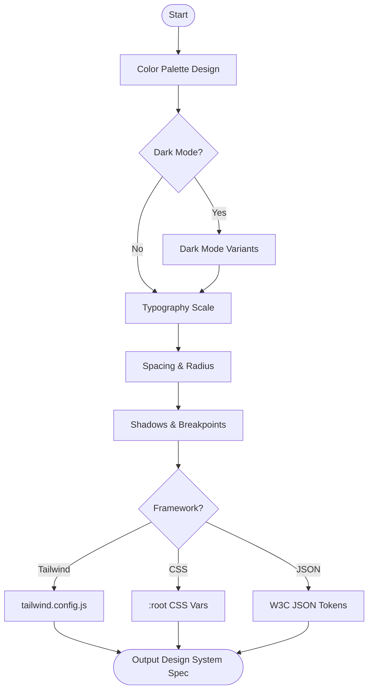

# Skill: Design System Specification

## Purpose
Generates complete design system specifications and foundational design tokens formatted for target frameworks.

## Input
| Variable | Type | Required | Description |
|----------|------|----------|-------------|
| `{{brand_name}}` | string | yes | Product/brand name |
| `{{primary_color}}` | string | yes | Primary brand color (hex or desc) |
| `{{style_direction}}` | string | yes | Visual style direction |
| `{{target_framework}}` | string | yes | Output format (Tailwind, CSS, JSON) |
| `{{dark_mode}}` | string | yes | Include dark mode ("yes"/"no") |

## Prompt
- **Color Palette**: Define Primary (9–11 shades), Secondary, Semantic (Success/Warning/Error/Info), and Neutral scales.
- **Typography**: Define Font Families, Sizes (xs–9xl), Weights, Line Heights, and Letter Spacing.
- **Spacing**: Define base unit (4px/8px) and named tokens (0–96).
- **Border Radius**: Define scale (none–full).
- **Shadow/Elevation**: Define 5–7 elevation levels with CSS box-shadows.
- **Breakpoints**: Define `xs` to `2xl` widths and target device classes.
- **Framework Export**: Render tokens in `{{target_framework}}` format (e.g., `tailwind.config.js`).

## Rules
- If `{{dark_mode}}` is "yes", provide explicit dark mode mappings.
- Normalize `{{brand_name}}` for prefixing.
- No conversational filler.

## Edge Cases
| Case | Strategy |
|------|----------|
| Color Desc | Select representative hex; state choice. |
| Saturation | Desaturate semantic/primary tokens for dark mode if high saturation. |
| No Convention | Default to W3C Design Tokens format for JSON output. |

## Output Format
- Seven sections (`##`).
- Token tables (Name, Value, Usage).
- Framework-specific code block.

## MCP Tools
| Tool | Server | Use Case |
|------|--------|----------|
| Figma | `figma-mcp` | Extract Figma styles to auto-populate tokens. |
| Style Dictionary | `style-dictionary-mcp` | Transform tokens between formats (JSON/CSS/Tailwind). |

## Senior Review Checklist
- [ ] Simplest token architecture?
- [ ] Dark mode contrast verified?
- [ ] Framework output (Tailwind/CSS) is valid syntax?
- [ ] Semantic colors follow accessibility rules?

## Changelog
| Version | Date | Description |
|---------|------|-------------|
| 1.1.0 | 2026-03-20 | Condensed format. |
| 1.0.0 | 2026-03-20 | Initial release. |

## Mermaid Diagram

