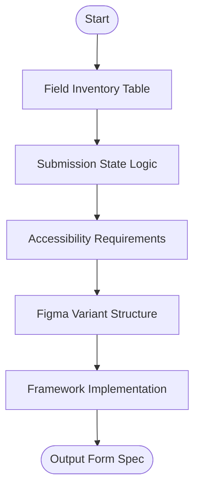

# Skill: Form Design Specification

## Purpose
Produces complete form specifications defining fields, validation, submission states, and accessibility requirements.

## Input
| Variable | Type | Required | Description |
|----------|------|----------|-------------|
| `{{form_name}}` | string | yes | Form name |
| `{{form_purpose}}` | string | yes | Form purpose |
| `{{framework}}` | string | yes | Frontend framework |
| `{{validation_approach}}` | string | yes | Validation trigger timing |
| `{{design_system}}` | string | no | Optional design system |

## Prompt
- **Field Inventory**: Table (Name, Type, Label, Placeholder, Required, Rules, Errors, Help Text).
- **Submission States**: Define visual/logic states for Loading, Success, and Error.
- **Accessibility**: ARIA attributes, label associations, keyboard nav, and screen reader announcements.
- **Figma Structure**: Frame dimensions, layer naming, and state variants.
- **Framework Implementation**: Notes on rule registration, trigger timing, and message display.

## Rules
- Use camelCase for field names.
- Error indicators must include icon + text (not just color).
- No filler text.

## Edge Cases
| Case | Strategy |
|------|----------|
| Multi-step | Produce field inventory per step; add nav states. |
| Validation Mismatch | Flag conflicts between approach and framework (e.g., real-time on HTML5). |
| File Uploads | Add MIME/size rules and a11y for file lists. |

## Output Format
- Five sections (`##`).
- Table for Field Inventory.
- Bulleted lists for behavior and accessibility.

## MCP Tools
| Tool | Server | Use Case |
|------|--------|----------|
| Figma | `figma-mcp` | Create frames with field components and variants. |

## Senior Review Checklist
- [ ] Simplest possible validation logic?
- [ ] Error messages are clear and actionable?
- [ ] A11y (ARIA/Labels) correctly mapped?
- [ ] Form states (Loading/Success/Error) fully defined?

## Changelog
| Version | Date | Description |
|---------|------|-------------|
| 1.1.0 | 2026-03-20 | Condensed format. |
| 1.0.0 | 2026-03-20 | Initial release. |

## Mermaid Diagram

