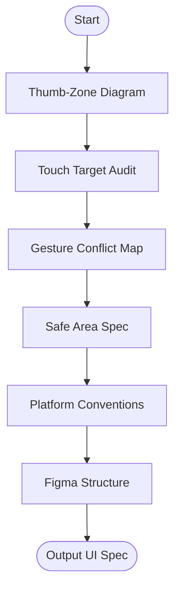

# Skill: Mobile-First UI Specification

## Purpose
Produces detailed mobile-first UI specifications covering usability, accessibility, and platform conventions.

## Input
| Variable | Type | Required | Description |
|----------|------|----------|-------------|
| `{{screen_name}}` | string | yes | Screen/feature name |
| `{{platform}}` | string | yes | Target platform |
| `{{primary_actions}}` | string | yes | Comma-separated user actions |
| `{{navigation_pattern}}` | string | yes | Navigation pattern |
| `{{device_target}}` | string | yes | Primary device target |

## Prompt
- **Thumb-Zone**: ASCII diagram for `{{device_target}}` (SAFE, STRETCH, HARD zones).
- **Touch Targets**: Table (Action, Type, Min Target, Recommended Size, Zone, Risk).
- **Gestures**: Table (Type, Target, Action, Conflict Risk).
- **Safe Area**: Inset specs (Top, Bottom, L/R) and content padding for `{{device_target}}`.
- **Conventions**: Checklist (Back nav, Nav bar, Type, Icons, Haptics, Accessibility).
- **Figma Structure**: Recommended dimensions, layer structure, auto-layout rules.

## Rules
- Min target: 44px (iOS) / 48dp (Android).
- Flag HARD zone placements as usability risks.
- No filler text.

## Edge Cases
| Case | Strategy |
|------|----------|
| React Native | Split conventions into iOS/Android columns. |
| Small Device | Recommend bottom sheets/overflow if >5 actions in SAFE zone. |
| Hamburger Menu | Flag swipe conflicts with system back gestures (Android). |
| PWA on iOS | Note Safari-specific limitations (haptics, viewport). |

## Output Format
- Six sections (`##`).
- ASCII Thumb-Zone diagram.
- Tables for targets, gestures, and conventions.

## MCP Tools
| Tool | Server | Use Case |
|------|--------|----------|
| Figma | `figma-mcp` | Create frames with safe area and thumb-zone overlays. |

## Senior Review Checklist
- [ ] Simplest possible solution?
- [ ] Usability risks (HARD zone) flagged?
- [ ] Gesture conflicts addressed?
- [ ] A11y (touch sizes) verified?

## Changelog
| Version | Date | Description |
|---------|------|-------------|
| 1.1.0 | 2026-03-20 | Condensed format. |
| 1.0.0 | 2026-03-20 | Initial release. |

## Mermaid Diagram

