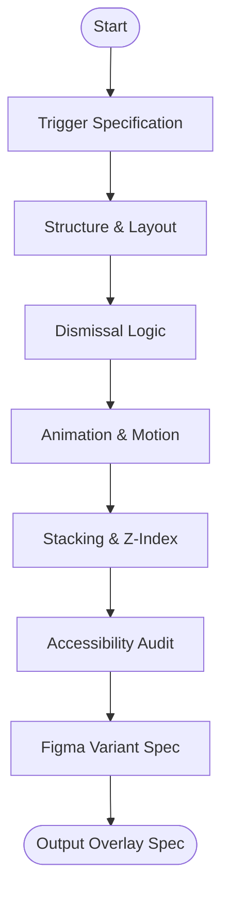

# Skill: Modal Overlay Design

## Purpose
Produces complete overlay specifications including triggers, structure, dismissal logic, and accessibility.

## Input
| Variable | Type | Required | Description |
|----------|------|----------|-------------|
| `{{overlay_name}}` | string | yes | Overlay name |
| `{{overlay_type}}` | string | yes | Dialog, drawer, tooltip, etc. |
| `{{trigger_element}}` | string | yes | Element triggering overlay |
| `{{content_description}}` | string | yes | Description of overlay content |
| `{{framework}}` | string | yes | Frontend framework |

## Prompt
- **Trigger**: Spec (Role, Attributes), interaction type, and state changes.
- **Structure**: Layout for Header, Body, and Footer with overflow rules.
- **Dismissal**: Logic for close buttons, backdrop click, Escape key, and conditions.
- **Animation**: Entry/Exit specs (direction, duration, easing) and motion fallbacks.
- **Stacking**: Z-index strategy and portal rendering necessity.
- **Accessibility**: ARIA roles, focus trap, initial focus, and return focus.
- **Figma Structure**: Layer naming, spacing, and state variants.

## Rules
- Hover-only tooltips must flag a11y gaps (require focus support).
- For non-dismissible dialogs, remove close buttons and Escape logic.
- No filler text.

## Edge Cases
| Case | Strategy |
|------|----------|
| Nested Overlays | Define z-index and stacked focus traps (inner first). |
| Desktop Bottom Sheet | Flag as mobile pattern; recommend dialog fallback. |
| No Native Trap | Recommend `focus-trap` or manual listener. |

## Output Format
- Seven sections (`##`).
- Bulleted lists for specs and requirements.

## MCP Tools
| Tool | Server | Use Case |
|------|--------|----------|
| Figma | `figma-mcp` | Create overlay frames with backdrop and states. |

## Senior Review Checklist
- [ ] Focus management (trap/return) addressed?
- [ ] Dismissal logic is clear?
- [ ] Z-index conflicts prevented?
- [ ] Animation reduced-motion fallbacks included?

## Changelog
| Version | Date | Description |
|---------|------|-------------|
| 1.1.0 | 2026-03-20 | Condensed format. |
| 1.0.0 | 2026-03-20 | Initial release. |

## Mermaid Diagram

