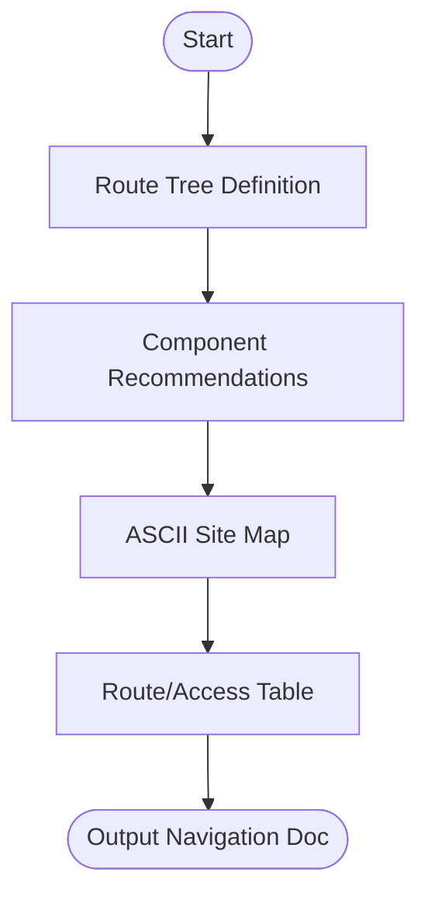

# Skill: Navigation Structure Design

## Purpose
Designs hierarchical navigation structures and site maps including route trees and component recommendations.

## Input
| Variable | Type | Required | Description |
|----------|------|----------|-------------|
| `{{app_name}}` | string | yes | Application name |
| `{{app_type}}` | string | yes | Application type |
| `{{user_roles}}` | string | yes | Comma-separated roles |
| `{{key_features}}` | string | yes | Comma-separated features |
| `{{platform}}` | string | yes | Target platform (e.g., "web") |

## Prompt
- **Route Tree**: Hierarchical list (Path, Page Name, Access Level, Parent) organized by domain.
- **Component Recs**: Suggestions for Nav bars, sidebars, etc., with placement based on `{{platform}}`.
- **ASCII Site Map**: Indented tree (2 spaces) with access levels in brackets (e.g., `[Public]`).
- **Route Table**: Table (Route, Page Name, Access Level, Nav Component, Notes).

## Rules
- Site map must be suitable for Excalidraw/draw.io import.
- No filler text.

## Edge Cases
| Case | Strategy |
|------|----------|
| High Complexity | If >10 features, group into sections; recommend sub-diagrams. |
| Cross-platform | Recommend separate components for web and mobile. |
| Marketing Site | Use flat public-only tree; note no auth needs. |

## Output Format
- Four sections (`##`).
- Plain text indented tree for site map.
- 5-column markdown table for routes.

## MCP Tools
| Tool | Server | Use Case |
|------|--------|----------|
| Excalidraw | `excalidraw-mcp` | Render visual tree diagrams. |
| draw.io | `drawio-mcp` | Create structured XML diagrams. |

## Senior Review Checklist
- [ ] Simplest hierarchy possible?
- [ ] Access levels (Auth/Public) clearly mapped?
- [ ] Components appropriate for the platform?
- [ ] Path naming consistent with standards?

## Changelog
| Version | Date | Description |
|---------|------|-------------|
| 1.1.0 | 2026-03-20 | Condensed format. |
| 1.0.0 | 2026-03-20 | Initial release. |

## Mermaid Diagram

